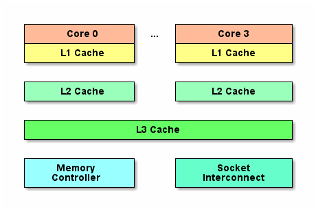
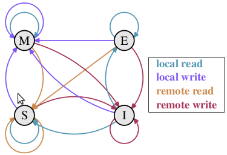

内存屏障是硬件之上、操作系统或JVM之下，对并发作出的最后一层支持。再向下是是硬件提供的支持；向上是操作系统或JVM对内存屏障作出的各种封装。内存屏障是一种标准，各厂商可能采用不同的实现。

本文仅为了帮助理解JVM提供的并发机制。首先，从volatile的语义引出可见性与重排序问题；接下来，阐述问题的产生原理，了解为什么需要内存屏障；然后，浅谈内存屏障的标准、厂商对内存屏障的支持，并以volatile为例讨论内存屏障如何解决这些问题；最后，补充介绍JVM在内存屏障之上作出的几个封装。为了帮助理解，会简要讨论硬件架构层面的一些基本原理（特别是CPU架构），但不会深入实现机制。

<!--more-->

>内存屏障的实现涉及大量硬件架构层面的知识，又需要操作系统或JVM的配合才能发挥威力，单纯从任何一个层面都无法理解。本文整合了这三个层面的大量知识，篇幅较长，希望能在一篇文章内，把内存屏障的基本问题讲述清楚。
>
>如有疏漏，还望指正！

# volatile变量规则

一个用于引出内存屏障的好例子是`volatile变量规则`。

volatile关键字可参考猴子刚开博客时的文章[volatile关键字的作用、原理](/2016/11/29/volatile关键字的作用、原理/)。volatile变量规则描述了volatile变量的**偏序**语义；这里从volatile变量规则的角度来讲解，顺便做个复习。

## 定义

volatile变量规则：**对volatile变量的写入操作必须在对该变量的读操作之前执行**。

volatile变量规则只是一种标准，要求JVM实现保证volatile变量的偏序语义。**结合程序顺序规则、传递性**，该偏序语义通常表现为两个作用：

* 保持可见性
* 禁用重排序（读操作禁止重排序之后的操作，写操作禁止重排序之前的操作）

>补充：
>
>* 程序顺序规则：如果程序中操作A在操作B之前，那么在线程中操作A将在操作B之前执行。
>* 传递性：如果操作A在操作B之前执行，并且操作B在操作C之前执行，那么操作A必须在操作C之前执行。

后文，如果仅涉及可见性，则指明“可见性”；如果二者均涉及，则以“偏序”代称。重排序一定会带来可见性问题，因此，不会出现单独讨论重排序的场景。

## 正确姿势

之前的文章多次涉及volatile变量规则的用法。

简单的仅利用volatile变量规则对volatile变量本身的可见性保证：

* [面试中单例模式有几种写法？](/2017/09/27/面试中单例模式有几种写法？/)：“饱汉 - 变种 3”在DCL的基础上，使用volatile修饰单例，以保证单例的可见性。

复杂的利用volatile变量规则（结合了程序顺序规则、传递性）保证变量本身及周围其他变量的偏序：

* [源码|并发一枝花之ReentrantLock与AQS（1）：lock、unlock](/2017/12/05/源码|并发一枝花之ReentrantLock与AQS（1）：lock、unlock/)：exclusiveOwnerThread借助于volatile变量state保证其相对于state的偏序。
* [源码|并发一枝花之CopyOnWriteArrayList](/2017/10/24/源码|并发一枝花之CopyOnWriteArrayList/)：CopyOnWriteArrayList借助于volatile变量array，对外提供偏序语义。

# 可见性与重排序

前文多次提到可见性与重排序的问题，内存屏障的存在就是为了解决这些问题。到底什么是可见性？什么是重排序？为什么会有这些问题？

## 可见性

### 定义

可见性的定义常见于各种并发场景中，以多线程为例：当一个线程修改了线程共享变量的值，其它线程能够立即得知这个修改。

从性能角度考虑，没有必要在修改后就立即同步修改的值——如果多次修改后才使用，那么只需要最后一次同步即可，在这之前的同步都是性能浪费。因此，实际的可见性定义要弱一些，只需要保证：**当一个线程修改了线程共享变量的值，其它线程在使用前，能够得到最新的修改值**。

>可见性可以认为是最弱的“`一致性`”（`弱一致`），只保证用户见到的数据是一致的，但不保证任意时刻，存储的数据都是一致的（`强一致`）。下文会讨论“缓存可见性”问题，部分文章也会称为“缓存一致性”问题。

### 问题来源

一个最简单的可见性问题来自计算机内部的缓存架构：



缓存大大缩小了高速CPU与低速内存之间的差距。以三层缓存架构为例：

* L1 Cache最接近CPU, 容量最小（如32K、64K等）、速度最高，每个核上都有一个L1 Cache。
* L2 Cache容量更大（如256K）、速度更低, 一般情况下，每个核上都有一个独立的L2 Cache。
* L3 Cache最接近内存，容量最大（如12MB），速度最低，在同一个CPU插槽之间的核共享一个L3 Cache。

>准确地说，每个核上有两个L1 Cache, 一个存数据 L1d Cache, 一个存指令 L1i Cache。

单核时代的一切都是那么完美。然而，多核时代出现了可见性问题。一个badcase如下：

1. Core0与Core1命中了内存中的同一个地址，那么各自的L1 Cache会缓存同一份数据的副本。
1. 最开始，Core0与Core1都在友善的读取这份数据。
1. 突然，Core0要使坏了，它修改了这份数据，使得两份缓存中的数据不同了，更确切的说，Core1 L1 Cache中的数据`失效`了。

单核时代只有Core0，Core0修改Core0读，没什么问题；但是，现在_Core0修改后，Core1并不知道数据已经失效，继续傻傻的使用_，轻则数据计算错误，重则导致死循环、程序崩溃等。

实际的可见性问题还要扩展到两个方向：

* 除三级缓存外，_各厂商实现的硬件架构中还存在多种多样的缓存，都存在类似的可见性问题_。例如，寄存器就相当于CPU与L1 Cache之间的缓存。
* 各种高级语言（包括Java）的多线程内存模型中，_在线程栈内自己维护一份缓存是常见的优化措施，但显然在CPU级别的缓存可见性问题面前，一切都失效了_。

>以上只是最简单的可见性问题，不涉及重排序等。
>
>重排序也会导致可见性问题；同时，缓存上的可见性也会引起一些看似重排序导致的问题。

## 重排序

### 定义

重排序并没有严格的定义。整体上可以分为两种：

* 真·重排序：**编译器、底层硬件（CPU等）出于“优化”的目的**，按照某种规则将指令重新排序（尽管有时候看起来像乱序）。
* 伪·重排序：由于**缓存同步顺序**等问题，看起来指令被重排序了。

重排序也是单核时代非常优秀的优化手段，有足够多的措施保证其在单核下的正确性。在多核时代，如果工作线程之间不共享数据或仅共享不可变数据，重排序也是性能优化的利器。然而，如果工作线程之间共享了可变数据，由于两种重排序的结果都不是固定的，会导致工作线程似乎表现出了随机行为。

>第一次接触重排序的概念一定很迷糊，耐心，耐心。

### 问题来源

重排序问题无时无刻不在发生，源自三种场景：

1. 编译器编译时的优化
1. 处理器执行时的乱序优化
1. 缓存同步顺序（导致可见性问题）

场景1、2属于真·重排序；场景3属于伪·重排序。场景3也属于可见性问题，为保持连贯性，我们先讨论场景3。

#### 可见性导致的伪·重排序

缓存同步顺序本质上是可见性问题。

假设`程序顺序`（program order）中先更新变量v1、再更新变量v2，不考虑真·重排序：

1. Core0先更新缓存中的v1，再更新缓存中的v2（位于两个缓存行，这样淘汰缓存行时不会一起写回内存）。
1. Core0读取v1（假设使用LRU协议淘汰缓存）。
1. Core0的缓存满，将最远使用的v2写回内存。
1. Core1的缓存中本来存有v1，现在将v2加载入缓存。

>重排序是针对程序顺序而言的，如果指令执行顺序与程序顺序不同，就说明这段指令被重排序了。

此时，_尽管“更新v1”的事件早于“更新v2”发生，但Core1只看到了v2的最新值，却看不到v1的最新值_。这属于可见性导致的**伪·重排序：虽然没有实际上没有重排序，但看起来发生了重排序**。

可以看到，缓存可见性不仅仅导致可见性问题，还会导致伪·重排序。因此，*只要解决了缓存上的可见性问题，也就解决了伪·重排序*。

##### MESI协议

回到可见性问题中的例子和可见性的定义。要解决这个问题很简单，套用可见性的定义，只需要：_在Core0修改了数据v后，让Core1在使用v前，能得到v最新的修改值_。

这个要求很弱，既可以在每次修改v后，都同步修改值到其他缓存了v的Cache中；又可以只同步使用前的最后一次修改值。后者性能上更优，如何实现呢：

1. Core0修改v后，发送一个信号，将Core1缓存的v标记为失效，并将修改值写回内存。
1. Core0可能会多次修改v，每次修改都只发送一个信号（发信号时会锁住缓存间的总线），Core1缓存的v保持着失效标记。
1. Core1使用v前，发现缓存中的v已经失效了，得知v已经被修改了，于是重新从其他缓存或内存中加载v。

以上即是MESI（Modified Exclusive Shared Or Invalid，缓存的四种状态）协议的基本原理，不算严谨，但对于理解缓存可见性（更常见的称呼是“缓存一致性”）已经足够。

MESI协议解决了CPU缓存层面的可见性问题。

>以下是MESI协议的缓存状态机，简单看看即可：
>
>
>
>状态：
>
>* M（修改, Modified）: 本地处理器已经修改缓存行, 即是脏行, 它的内容与内存中的内容不一样. 并且此cache只有本地一个拷贝（专有）。
>* E（专有, Exclusive）: 缓存行内容和内存中的一样, 而且其它处理器都没有这行数据。
>* S（共享, Shared）: 缓存行内容和内存中的一样, 有可能其它处理器也存在此缓存行的拷贝。
>* I（无效, Invalid）: 缓存行失效, 不能使用。
>

##### 剩余问题

既然有了MESI协议，是不是就不需要volatile的可见性语义了？当然不是，还有三个问题：

* **并不是所有的硬件架构都提供了相同的一致性保证，JVM需要volatile统一语义**（就算是MESI，也只解决CPU缓存层面的问题，没有涉及其他层面）。
* 可见性问题不仅仅局限于CPU缓存内，JVM自己维护的内存模型中也有可见性问题。使用volatile做标记，可以解决JVM层面的可见性问题。
* 如果不考虑真·重排序，MESI确实解决了CPU缓存层面的可见性问题；然而，真·重排序也会导致可见性问题。

>暂时第一个问题称为“`内存可见性`”问题，内存屏障解决了该问题。后文讨论。

#### 编译器编译时的优化

>JVM自己维护的内存模型中也有可见性问题，使用volatile做标记，取消volatile变量的缓存，就解决了JVM层面的可见性问题。编译器产生的重排序也采用了同样的思路。

编译器为什么要重排序（re-order）呢？和处理器乱序执行的目的是一样的：与其等待阻塞指令（如等待缓存刷入）完成，不如先去执行其他指令。与处理器乱序执行相比，编译器重排序能够完成更大范围、效果更好的乱序优化。

>由于同处理器乱序执行的目的相同，原理相似，这里不讨论编译器重排序的实现原理。

幸运的是，既然是编译器层面的重排序，自然可以由编译器控制。使用volatile做标记，就可以禁用编译器层面的重排序。

#### 处理器执行时的乱序优化

处理器层面的乱序优化节省了大量等待时间，提高了处理器的性能。

所谓“乱序”只是被叫做“乱序”，实际上也遵循着一定规则：只要两个指令之间不存在数据依赖，就可以对这两个指令乱序。不必关心数据依赖的精确定义，可以理解为：**只要不影响程序单线程、顺序执行的结果，就可以对两个指令重排序**。

>不进行乱序优化时，处理器的指令执行过程如下：
>
>1. 指令获取。
>1. 如果输入的运算对象是可以获取的（比如已经存在于寄存器中），这条指令会被发送到合适的功能单元。如果一个或者更多的运算对象在当前的时钟周期中是不可获取的（通常需要从主内存获取），处理器会开始等待直到它们是可以获取的。
>1. 指令在合适的功能单元中被执行。
>1. 功能单元将运算结果写回寄存器。
>
>乱序优化下的执行过程如下：
>
>1. 指令获取。
>1. 指令被发送到一个指令序列（也称`执行缓冲区`或者`保留站`）中。
>1. **指令将在序列中等待，直到它的数据运算对象是可以获取的。然后，指令被允许在先进入的、旧的指令之前离开序列缓冲区**。（此处表现为乱序）
>1. 指令被分配给一个合适的功能单元并由之执行。
>1. 结果被放到一个序列中。
>1. 仅当所有在该指令之前的指令都将他们的结果写入寄存器后，这条指令的结果才会被写入寄存器中。（重整乱序结果）
>
>当然，为了实现乱序优化，还需要很多技术的支持，如`寄存器重命名`、`分枝预测`等，但大致了解到这里就足够。后文的注释中会据此给出内存屏障的实现方案。

乱序优化在单核时代不影响正确性；但多核时代的多线程能够在不同的核上实现真正的并行，一旦线程间共享数据，就出现问题了。看一段很经典的代码：

```java
public class OutofOrderExecution {
    private static int x = 0, y = 0;
    private static int a = 0, b = 0;
    
    public static void main(String[] args)
        throws InterruptedException {
        Thread t1 = new Thread(new Runnable() {
            public void run() {
                a = 1;
                x = b;
            }
        });
        Thread t2 = new Thread(new Runnable() {
            public void run() {
                b = 1;
                y = a;
            }
        });
        t1.start();
        t2.start();
        t1.join();
        t2.join();
        System.out.println(“(” + x + “,” + y + “)”);
    }
}
```

*不考虑编译器重排序和缓存可见性问题*，上面的代码可能会输出什么呢？

最容易想到的结果是`(0,1)`、`(1,0)`或`(1,1)`。因为可能先后执行线程t1、t2，也可能反之，还可能t1、t2交替执行。

然而，_这段代码的执行结果也可能是(0,0)_，看起来违反常理。这是处理器乱序执行的结果：线程t1内部的两行代码之间不存在数据依赖，因此，可以将`x = b`乱序到`a = 1`前；同时，线程t2中的`y = a`早于线程t1中的`a = 1`执行。一个可能的执行序列如下：

1. t1: x = b
1. t2: b = 1
1. t2: y = a
1. t1: a = 1

>这里将代码等同于指令，不严谨，但不妨碍理解。

看起来，似乎将上述重排序（或乱序）导致的问题称为“可见性”问题也未尝不可。然而，这种重排序的危害要远远大于单纯的可见性，因为并不是所有的指令都是简单的读或者写——[面试中单例模式有几种写法？](/2017/09/27/面试中单例模式有几种写法？/)与[volatile关键字的作用、原理](/2016/11/29/volatile关键字的作用、原理/)中都提到了`部分初始化`的例子，这种`不安全发布`就是由于重排序导致的。因此，**将重排序归为“可见性”问题并不合适，只能说重排序会导致可见性问题**。

也就是说，单纯解决内存可见性问题是不够的，还**需要专门解决`处理器重排序`的问题**。

>当然，某些处理器不会对指令乱序，或能够基于多核间的数据依赖乱序。这时，volatile仅用于统一重排序方面的语义。

# 内存屏障

>内存屏障（Memory Barrier）与内存栅栏（Memory Fence）是同一个概念，不同的叫法。

通过**volatile标记，可以解决编译器层面的可见性与重排序问题**。而**内存屏障则解决了硬件层面的可见性与重排序问题**。

>猴子暂时没有验证下述分析，仅从逻辑和系统设计考量上进行了判断、取舍。以后会补上实验。

## 标准

先简单了解两个指令：

* Store：将处理器缓存的数据刷新到内存中。
* Load：将内存存储的数据拷贝到处理器的缓存中。

| 屏障类型 | 指令示例 | 说明 |
|:------------- |:--------------- |:------------- |
| LoadLoad Barriers | Load1;LoadLoad;Load2 | 该屏障确保Load1数据的装载先于Load2及其后所有装载指令的的操作 |
| StoreStore Barriers | Store1;StoreStore;Store2 | 该屏障确保Store1立刻刷新数据到内存(使其对其他处理器可见)的操作先于Store2及其后所有存储指令的操作 |
| LoadStore Barriers | Load1;LoadStore;Store2 | 确保Load1的数据装载先于Store2及其后所有的存储指令刷新数据到内存的操作 |
| StoreLoad Barriers | Store1;StoreLoad;Load2 | 该屏障确保Store1立刻刷新数据到内存的操作先于Load2及其后所有装载装载指令的操作。它会使该屏障之前的所有内存访问指令(存储指令和访问指令)完成之后,才执行该屏障之后的内存访问指令 |

StoreLoad Barriers同时具备其他三个屏障的效果，因此也称之为`全能屏障`（mfence），是目前大多数处理器所支持的；但是相对其他屏障，该屏障的开销相对昂贵。

然而，**除了mfence，不同的CPU架构对内存屏障的实现方式与实现程度非常不一样**。相对来说，Intel CPU的`强内存模型`比DEC Alpha的`弱复杂内存模型`（缓存不仅分层了，还分区了）更简单。x86架构是在多线程编程中最常见的，下面讨论x86架构中内存屏障的实现。

>查阅资料时，你会发现每篇讲内存屏障的文章讲的都不同。不过，重要的是理解基本原理，需要的时候再继续深究即可。
>
>不过不管是那种方案，**内存屏障的实现都要针对乱序执行的过程来设计**。前文的注释中讲解了乱序执行的基本原理：核心是一个**序列缓冲区**，只要指令的数据运算对象是可以获取的，指令就被允许在先进入的、旧的指令之前离开序列缓冲区，开始执行。对于内存可见性的语义，内存屏障可以通过使用类似MESI协议的思路实现。对于重排序语义的实现机制，猴子没有继续研究，一种可行的思路是：
>
>* 当CPU收到屏障指令时，不将屏障指令放入序列缓冲区，而将屏障指令及后续所有指令放入一个FIFO队列中（指令是按批发送的，不然没有乱序的必要）
>* 允许乱序执行完序列缓冲区中的所有指令
>* 从FIFO队列中取出屏障指令，执行（并刷新缓存等，实现内存可见性的语义）
>* 将FIFO队列中的剩余指令放入序列缓冲区
>* 恢复正常的乱序执行
>
>对于x86架构中的sfence屏障指令而言，则保证sfence之前的store执行完，再执行sfence，最后执行sfence之后的store；除了禁用sfence前后store乱序带来的新的数据依赖外，不影响load命令的乱序。详细见后。

## x86架构的内存屏障

x86架构并没有实现全部的内存屏障。

### Store Barrier

sfence指令实现了Store Barrier，相当于StoreStore Barriers。

强制所有在sfence指令之前的store指令，都在该sfence指令执行之前被执行，发送缓存失效信号，并把store buffer中的数据刷出到CPU的L1 Cache中；所有在sfence指令之后的store指令，都在该sfence指令执行之后被执行。即，禁止对sfence指令前后store指令的重排序跨越sfence指令，使**所有Store Barrier之前发生的内存更新都是可见的**。

这里的“可见”，指**修改值可见**（内存可见性）且**操作结果可见**（禁用重排序）。下同。

>内存屏障的标准中，讨论的是缓存与内存间的`相干性`，实际上，同样适用于寄存器与缓存、甚至寄存器与内存间等多级缓存之间。x86架构使用了MESI协议的一个变种，由协议保证三层缓存与内存间的相关性，则内存屏障只需要保证store buffer（可以认为是寄存器与L1 Cache间的一层缓存）与L1 Cache间的相干性。下同。

### Load Barrier

lfence指令实现了Load Barrier，相当于LoadLoad Barriers。

强制所有在lfence指令之后的load指令，都在该lfence指令执行之后被执行，并且一直等到load buffer被该CPU读完才能执行之后的load指令（发现缓存失效后发起的刷入）。即，禁止对lfence指令前后load指令的重排序跨越lfence指令，配合Store Barrier，使**所有Store Barrier之前发生的内存更新，对Load Barrier之后的load操作都是可见的**。

### Full Barrier

mfence指令实现了Full Barrier，相当于StoreLoad Barriers。

mfence指令综合了sfence指令与lfence指令的作用，强制所有在mfence指令之前的store/load指令，都在该mfence指令执行之前被执行；所有在mfence指令之后的store/load指令，都在该mfence指令执行之后被执行。即，禁止对mfence指令前后store/load指令的重排序跨越mfence指令，使**所有Full Barrier之前发生的操作，对所有Full Barrier之后的操作都是可见的。**

## volatile如何解决内存可见性与处理器重排序问题

>在编译器层面，仅将volatile作为标记使用，取消编译层面的缓存和重排序。

如果硬件架构本身已经保证了内存可见性（如单核处理器、一致性足够的内存模型等），那么volatile就是一个空标记，不会插入相关语义的内存屏障。

如果硬件架构本身不进行处理器重排序、有更强的重排序语义（能够分析多核间的数据依赖）、或在单核处理器上重排序，那么volatile就是一个空标记，不会插入相关语义的内存屏障。

如果不保证，仍以x86架构为例，JVM对volatile变量的处理如下：

* 在写volatile变量v之后，插入一个sfence。这样，sfence之前的所有store（包括写v）不会被重排序到sfence之后，sfence之后的所有store不会被重排序到sfence之前，禁用跨sfence的store重排序；且sfence之前修改的值都会被写回缓存，并标记其他CPU中的缓存失效。
* 在读volatile变量v之前，插入一个lfence。这样，lfence之后的load（包括读v）不会被重排序到lfence之前，lfence之前的load不会被重排序到lfence之后，禁用跨lfence的load重排序；且lfence之后，会首先刷新无效缓存，从而得到最新的修改值，与sfence配合保证内存可见性。

>在另外一些平台上，JVM使用mfence代替sfence与lfence，实现更强的语义。

二者结合，共同实现了Happens-Before关系中的volatile变量规则。

# JVM对内存屏障作出的其他封装

除volatile外，常见的JVM实现还基于内存屏障作了一些其他封装。**借助于内存屏障，这些封装也得到了内存屏障在可见性与重排序上的语义**。

>借助：piggyback。
>
>在JVM中，借助通常指：将Happens-Before的程序顺序规则与其他某个顺序规则（通常是监视器锁规则、volatile变量规则）结合起来，从而对某个未被锁保护的变量的访问操作进行排序。
>
>本文将借助的语义扩展到更大的范围，可以借助任何现有机制，以获得现有机制的某些属性。当然，并不是所有属性都能被借助，比如原子性。但基于前文对内存屏障的分析可知，可见性与重排序是可以被借助的。

下面仍基于x86架构讨论。

## final关键字

如果一个实例的字段被声明为final，则JVM会在初始化final变量后插入一个sfence。

>类的final字段在`<clinit>()`方法中初始化，其可见性由JVM的类加载过程保证。

final字段的初始化在`<init>()`方法中完成。sfence禁用了sfence前后对store的重排序，且保证final字段初始化之前（include）的内存更新都是可见的。

### 再谈部分初始化

上述良好性质被称为“`初始化安全性`”。它保证，**对于被正确构造的对象，所有线程都能看到构造函数给对象的各个final字段设置的正确值，而不管采用何种方式来发布对象**。

>**这里将可见性从“final字段初始化之前（include）的内存更新”缩小到“final字段初始化”**。猴子没找到确切的原因，手里暂时只有一个jdk也不方便验证。可能是因为，_JVM没有要求虚拟机实现在生成`<init>()`方法时编排字段初始化指令的顺序_。

初始化安全性为解决部分初始化问题带来了新的思路：如果待发布对象的所有域都是final修饰的，那么可以防止对对象的初始引用被重排序到构造过程完成之前。于是，[面试中单例模式有几种写法？](/2017/09/27/面试中单例模式有几种写法？/)中的饱汉变种三还可以扔掉volatile，改为借助final的sfence语义：

```java
// 饱汉
// ThreadSafe
public class Singleton1_3 {
  private static Singleton1_3 singleton = null;

  public int f1 = 1;   // 触发部分初始化问题
  public int f2 = 2;

  private Singleton1_3() {
  }

  public static Singleton1_3 getInstance() {
    if (singleton == null) {
      synchronized (Singleton1_3.class) {
        // must be a complete instance
        if (singleton == null) {
          singleton = new Singleton1_3();
        }
      }
    }
    return singleton;
  }
}
```

>注意，初始化安全性仅针对安全发布中的部分初始化问题，与其他安全发布问题、发布后的可见性问题无关。

## CAS

在x86架构上，CAS被翻译为"`lock cmpxchg...`"。cmpxchg是CAS的汇编指令。在CPU架构中依靠lock信号保证可见性并禁止重排序。

lock前缀是一个特殊的信号，执行过程如下：

* 对总线和缓存上锁。
* 强制所有lock信号之前的指令，都在此之前被执行，并同步相关缓存。
* 执行lock后的指令（如cmpxchg）。
* 释放对总线和缓存上的锁。
* 强制所有lock信号之后的指令，都在此之后被执行，并同步相关缓存。

因此，lock信号虽然不是内存屏障，但具有mfence的语义（当然，还有`排他性`的语义）。

与内存屏障相比，lock信号要额外对总线和缓存上锁，成本更高。

## 锁

JVM的内置锁通过操作系统的管程实现。且不论管程的实现原理，由于管程是一种互斥资源，修改互斥资源至少需要一个CAS操作。因此，锁必然也使用了lock信号，具有mfence的语义。

锁的mfence语义实现了Happens-Before关系中的监视器锁规则。

>CAS具有同样的mfence语义，也必然具有与锁相同的偏序关系。尽管JVM没有对此作出显式的要求。

---

>参考:
>
>* [从Java视角理解系统结构(一)CPU上下文切换](http://ifeve.com/java-context-switch/)
>* [从Java视角理解系统结构（二）CPU缓存](http://ifeve.com/from-javaeye-cpu-cache/)
>* [从Java视角理解系统结构（三）伪共享](http://ifeve.com/from-javaeye-false-sharing/)
>* [面试必问的volatile，你了解多少？](https://www.jianshu.com/p/506c1e38a922)
>* [乱序执行](https://zh.wikipedia.org/wiki/%E4%B9%B1%E5%BA%8F%E6%89%A7%E8%A1%8C)
>* [（转）CPU乱序执行原理](http://blog.csdn.net/gjq_1988/article/details/39520729)
>* [Java内存访问重排序的研究](https://tech.meituan.com/java-memory-reordering.html)
>* [谈乱序执行和内存屏障](http://blog.csdn.net/dd864140130/article/details/56494925)
>* [内存屏障](http://ifeve.com/memory-barriers-or-fences/)（阅读本文的原文需要翻墙，这里给出一篇译文的地址）
>* [聊聊原子变量、锁、内存屏障那点事](http://0xffffff.org/2017/02/21/40-atomic-variable-mutex-and-memory-barrier/)
>* [聊聊高并发（三十五）Java内存模型那些事（三）理解内存屏障](聊聊高并发（三十五）Java内存模型那些事（三）理解内存屏障)
