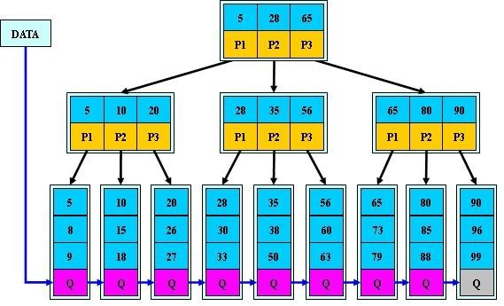

MySQL的MyISAM、InnoDB引擎默认均使用B+树索引（查询时都显示为“BTREE”），本文讨论两个问题：

* 为什么MySQL等主流数据库选择B+树的索引结构？
* 如何基于索引结构，理解常见的MySQL索引优化思路？

<!--more-->

# 为什么索引无法全部装入内存

索引结构的选择基于这样一个性质：**大数据量时，索引无法全部装入内存**。

为什么索引无法全部装入内存？假设使用树结构组织索引，简单估算一下：

* 假设单个索引节点12B，1000w个数据行，unique索引，则叶子节点共占约100MB，整棵树最多200MB。
* 假设一行数据占用200B，则数据共占约2G。

假设索引存储在内存中。也就是说，每在物理盘上保存2G的数据，就要占用200MB的内存，_`索引:数据的占用比`约为1/10_。1/10的占用比算不算大呢？物理盘比内存廉价的多，以一台内存16G硬盘1T的服务器为例，_如果要存满1T的硬盘，至少需要100G的内存_，远大于16G。

考虑到一个表上可能有多个索引、联合索引、数据行占用更小等情况，实际的占用比通常大于1/10，某些时候能达到1/3。**在基于索引的存储架构中，`索引:数据的占用比`过高，因此，索引无法全部装入内存**。

# 其他结构的问题

由于无法装入内存，则必然依赖磁盘（或SSD）存储。而内存的读写速度是磁盘的成千上万倍（与具体实现有关），因此，核心问题是“**如何减少磁盘读写次数**”。

首先不考虑页表机制，假设每次读、写都直接穿透到磁盘，那么：

* 线性结构：读/写平均O(n)次
* 二叉搜索树（BST）：读/写平均O(log2(n))次；如果树不平衡，则最差读/写O(n)次
* 自平衡二叉搜索树（AVL）：在BST的基础上加入了自平衡算法，读/写最大O(log2(n))次
* 红黑树（RBT）：另一种自平衡的查找树，读/写最大O(log2(n))次

BST、AVL、RBT很好的将读写次数从O(n)优化到O(log2(n))；其中，AVL和RBT都比BST多了自平衡的功能，将读写次数降到最大O(log2(n))。

假设使用自增主键，则主键本身是有序的，树结构的读写次数能够优化到树高，树高越低读写次数越少；自平衡保证了树结构的稳定。如果想进一步优化，可以引入B树和B+树。

# B树解决了什么问题

>很多文章将B树误称为B-（减）树，这可能是对其英文名“B-Tree”的误解（更有甚者，将B树称为二叉树或二叉搜索树）。特别是与B+树一起讲的时候。想当然的认为有B+（加）树就有B-（减）树，实际上B+树的英文名是“B+-Tree”。

如果抛开维护操作，那么B树就像一棵“m叉搜索树”（m是子树的最大个数），时间复杂度为O(logm(n))。然而，B树设计了一种高效简单的维护操作，使B树的深度维持在约log(ceil(m/2))(n)~logm(n)之间，**大大降低树高**。

>再次强调：
>
>不要纠结于时间复杂度，与单纯的算法不同，磁盘IO次数才是更大的影响因素。读者可以推导看看，B树与AVL的时间复杂度是相同的，但由于B树的层数少，磁盘IO次数少，实践中B树的性能要优于AVL等二叉树。

同二叉搜索树类似，每个节点存储了多个key和子树，子树与key按顺序排列。

页表的目的是扩展内存+加速磁盘读写。一个页（Page）通常4K（等于磁盘数据块block的大小，见inode与block的分析），从磁盘读写的角度出发，操作系统每次以页为单位将内容从磁盘加载到内存（以摊分寻道成本），修改页后，再择期将该页写回磁盘。考虑到页表的良好性质，可以使每个节点的大小约等于一个页（使m非常大），这每次加载的一个页就能完整覆盖一个节点，以便选择下一层子树；对子树同理。对于页表来说，AVL（或RBT）相当于1个key+2个子树的B树，由于逻辑上相邻的节点，物理上通常不相邻，因此，读入一个4k页，页面内绝大部分空间都将是无效数据。

假设key、子树节点指针均占用4B，则B树节点最大`m * (4 + 4) = 8m B`；页面大小4KB。则`m = 4 * 1024 / 8 = 512`，一个512叉的B树，1000w的数据，深度最大 `log(512/2)(10^7) = 3.02 ~= 4`。对比二叉树如AVL的深度为`log(2)(10^7) = 23.25 ~= 24`，相差了5倍以上。震惊！B树索引深度竟然如此！

另外，B树**对局部性原理非常友好**。如果key比较小（比如上面4B的自增key），则除了页表的加成，缓存还能进一步预读加速。美滋滋~

# B+树解决了什么问题

## B树的剩余问题

然而，如果要实际应用到数据库的索引中，B树还有一些问题：

1. 未定位数据行
2. 无法处理范围查询

### 问题1

数据表的记录有多个字段，仅仅定位到主键是不够的，还需要定位到数据行。有3个方案解决：

1. 直接将key对应的数据行（可能对应多行）存储在节点中。
2. 数据行单独存储；节点中增加一个字段，定位key对应数据行的位置。
3. 修改key与子树的判断逻辑，使子树大于等于上一key小于下一key，最终所有访问都将落于叶子节点；叶子节点中直接存储数据行或数据行的位置。

方案1中，数据行通常非常大，存储数据行将减少页面中的子树个数，m减小树高增大。假设数据行占用200B，可忽略组织B树的指针，则新的`m = 4 * 1024 / 200 = 20.48 ~= 21`，深度最大 `log(21/2)(10^7) ~= 7`。增加了一倍以上的IO，不考虑。

方案2中，节点增加了一个字段。假设是4B的指针，则新的`m = 4 * 1024 / 12 = 341.33 ~= 341`，深度最大 `log(341/2)(10^7) = 3.14 ~= 4`。与3差别不大，可以考虑。

方案3的节点m与深度不变，但时间复杂度变为稳定的O(logm(n))。考虑。

### 问题2

实际业务中，范围查询的频率非常高，B树只能定位到一个索引位置（可能对应多行），很难处理范围查询。给出2种方案：

1. 不改动：查询的时候先查到左界，再查到右界，然后DFS（或BFS）遍历左界、右界之间的节点。
2. 在“问题1-方案3”的基础上，由于所有数据行都存储在叶子节点，B树的叶子节点本身也是有序的，可以增加一个指针，指向当前叶子节点按主键顺序的下一叶子节点；查询时先查到左界，再查到右界，然后从左界到有界线性遍历。

乍一看感觉方案1比方案2好——时间复杂度和常数项都一样，方案1还不需要改动。但是别忘了局部性原理，不管节点中存储的是数据行还是数据行位置，方案2的好处在于，叶子节点连续存储，对页表和缓存友好。而方案1则面临节点逻辑相邻、物理分离的缺点。

## 引出B+树

综上，问题1的方案2与问题2的方案1可整合为一种方案（基于B树的索引），问题1的方案3与问题2的方案2可整合为一种（基于B+树的索引）。实际上，数据库、文件系统有些采用了B树，有些采用B+树。

**由于某些猴子暂未明白的原因**，包括MySQL在内的主流数据库多选择了B+树。即：

主要变动如上所述：

* 修改key与子树的组织逻辑，将索引访问都落到叶子节点
* 按顺序将叶子节点串起来（方便范围查询）

## B树和B+树的增、删、查过程

B树的增删过程暂时可参考[从B树、B+树、B*树谈到R 树](http://blog.csdn.net/v_JULY_v/article/details/6530142/)的“6、B树的插入、删除操作”小节，B+树的增删同理。此处暂不赘述。

<!--TODO 20180306 举例-->

# Mysql索引优化

根据B+树的性质，很容易理解各种常见的MySQL索引优化思路。

>暂不考虑不同引擎之间的区别。

## 优先使用自增key作为主键

前面的分析中，假设用4B的自增key作为索引，则m可达到512，层高仅有3。使用自增的key有两个好处：

1. 自增key一般为int等整数型，key比较紧凑，这样m可以非常大，而且索引占用空间小。最极端的例子，如果使用50B的varchar（包括长度），那么`m = 4 * 1024 / 54m = 75.85 ~= 76`，深度最大 `log(76/2)(10^7) = 4.43 ~= 5`，再加上cache缺失、字符串比较的成本，时间成本增加较大。同时，key由4B增长到50B，整棵索引树的空间占用增长也是极为恐怖的（如果二级索引使用主键定位数据行，则空间增长更加严重）。
2. 自增的性质使得新数据行的插入请求必然落到索引树的最右侧，发生节点分裂的频率较低，理想情况下，索引树可以达到“满”的状态。索引树满，一方面层高更低，一方面删除节点时发生节点合并的频率也较低。

>优化经历：
>
>猴子曾使用varchar(100)的列做过主键，存储containerId，过了3、4天100G的数据库就满了，DBA小姐姐邮件里委婉表示了对我的鄙视。。。之后增加了自增列作为主键，containerId作为unique的二级索引，时间、空间优化效果相当显著。

## 最左前缀匹配

索引可以简单如一个列(a)，也可以复杂如多个列(a, b, c, d)，即`联合索引`。如果是联合索引，那么key也由多个列组成，同时，索引只能用于查找key是否存在（相等），遇到范围查询(>、<、between、like左匹配)等就不能进一步匹配了，后续退化为线性查找。因此，列的排列顺序决定了可命中索引的列数。

如有索引(a, b, c, d)，查询条件`a = 1 and b = 2 and c > 3 and d = 4`，则会在每个节点依次命中a、b、c，无法命中d。也就是最左前缀匹配原则。

### =、in自动优化顺序

不需要考虑=、in等的顺序，mysql会自动优化这些条件的顺序，以匹配尽可能多的索引列。

如有索引(a, b, c, d)，查询条件`c > 3 and b = 2 and a = 1 and d < 4`与`a = 1 and c > 3 and b = 2 and d < 4`等顺序都是可以的，MySQL会自动优化为`a = 1 and b = 2 and c > 3 and d < 4`，依次命中a、b、c。

## 索引列不能参与计算

有索引列参与计算的查询条件对索引不友好（甚至无法使用索引），如`from_unixtime(create_time) = '2014-05-29'`。

原因很简单，如何在节点中查找到对应key？如果线性扫描，则每次都需要重新计算，成本太高；如果二分查找，则需要针对from_unixtime方法确定大小关系。

因此，索引列不能参与计算。上述`from_unixtime(create_time) = '2014-05-29'`语句应该写成`create_time = unix_timestamp('2014-05-29')`。

## 能扩展就不要新建索引

如果已有索引(a)，想建立索引(a, b)，尽量选择修改索引(a)为索引(a, b)。

新建索引的成本很容易理解。而基于索引(a)修改为索引(a, b)的话，MySQL可以直接在索引a的B+树上，经过分裂、合并等修改为索引(a, b)。

## 不需要建立前缀有包含关系的索引

如果已有索引(a, b)，则不需要再建立索引(a)，但是如果有必要，则仍然需考虑建立索引(b)。

## 选择区分度高的列作索引

很容易理解。如，用性别作索引，那么索引仅能将1000w行数据划分为两部分（如500w男，500w女），索引几乎无效。

`区分度`的公式是`count(distinct <col>) / count(*)`，表示字段不重复的比例，比例越大区分度越好。唯一键的区分度是1，而一些状态、性别字段可能在大数据面前的区分度趋近于0。

>这个值很难确定，一般需要join的字段要求是0.1以上，即平均1条扫描10条记录。

---

>参考：
>
>* [从B树、B+树、B*树谈到R 树](http://blog.csdn.net/v_JULY_v/article/details/6530142/)
>* [MySQL索引原理及慢查询优化](https://tech.meituan.com/mysql-index.html)
>
