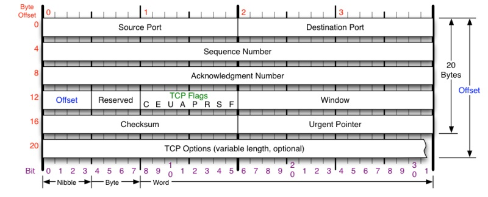
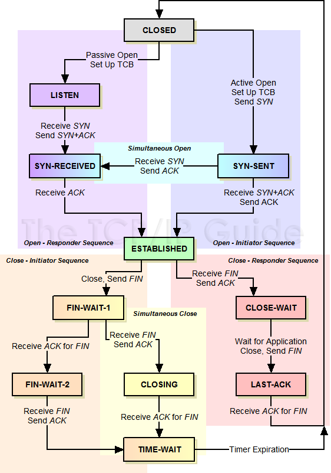
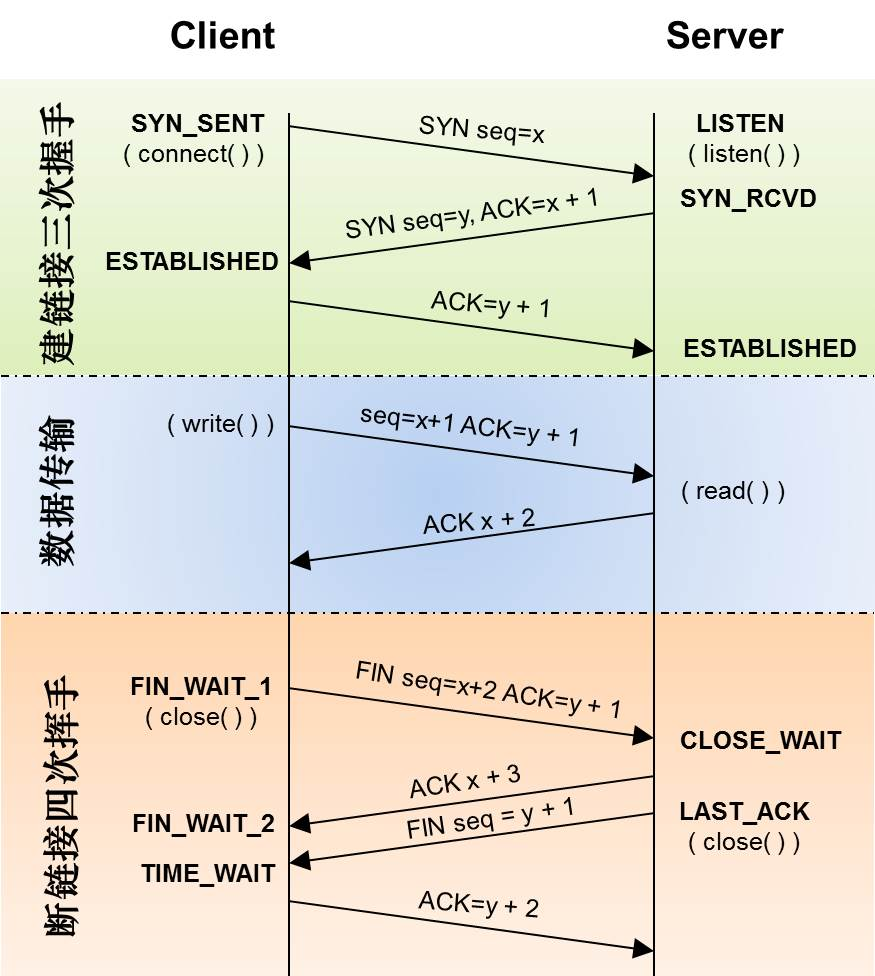
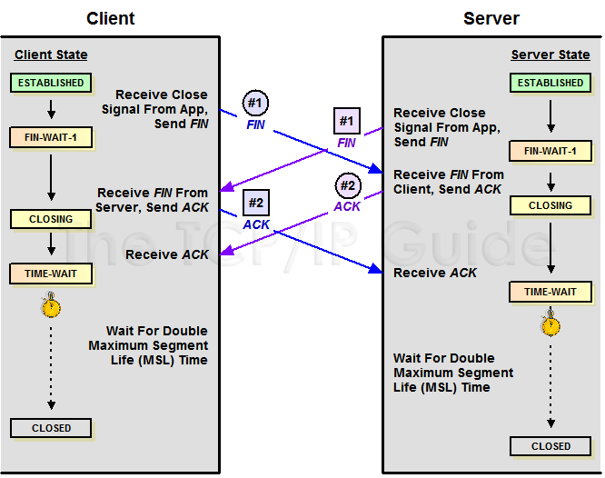
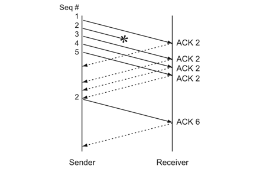

TCP协议比较复杂，接下来分两篇文章浅要介绍TCP中的一些要点。

本文介绍TCP的状态机与重传机制，下文讲解流量控制与拥塞控制。

>本文大部分内容基于[TCP 的那些事儿（上）](https://coolshell.cn/articles/11564.html)修改而来，部分观点与原文不同，重要地方增加了解释。

<!--more-->

# 前置知识

## 一些网络基础

TCP在网络OSI的七层模型中的第四层——Transport层，IP在第三层——Network层，ARP在第二层——Data Link层，在第二层上的数据，我们叫Frame，在第三层上的数据叫Packet，第四层的数据叫Segment。

应用层的数据首先会打到TCP的Segment中，然后TCP的Segment会打到IP的Packet中，然后再打到以太网Ethernet的Frame中，传到对端后，各个层解析自己的协议，然后把数据交给更高层的协议处理。

## TCP头格式

在正式讨论之前，先来看一下TCP头的格式：

注意：

* TCP的包是没有IP地址的，那是IP层上的事。但是有源端口和目标端口。
* 一个TCP连接需要四个元组来表示是同一个连接（src_ip, src_port, dst_ip, dst_port）（准确说是五元组，还有一个是协议，但因为这里只是说TCP协议，所以，这里我只说四元组）。
* 注意上图中的四个非常重要的东西：
    * `Sequence Number`，包的序号Seq，_用于解决网络包乱序_（reordering）。
    * `Acknowledgement Number`，Ack用于确认收到Seq（Ack = Seq + 1，表示收到了Seq及Seq之前的数据包，期待Seq + 1），_用于解决丢包_。
    * `Window`，又叫`Advertised Window`，可以近似理解为`滑动窗口`（Sliding Window）的大小，_用于流控_。
    * `TCP Flag` ，区分包的类型，如SYN包、FIN包、RST包等，主要_用于操控TCP状态机_。

其他字段参考下图：

# TCP的状态机

其实，**网络传输是没有连接的——TCP所谓的“连接”，其实只不过是在通讯的双方维护一个“连接状态”**，让它看上去好像有连接一样。所以，TCP的状态转换非常重要。

下面是**简化**的“TCP协议状态机” 和 “TCP三次握手建连接 + 传数据 + 四次挥手断连接” 的对照图，两张图本质上都描述了TCP协议状态机，但场景略有不同。**这两个图非常重要，一定要记牢**。

TCP协议状态机，不区分client、server：

下图是经典的“TCP三次握手建连接 + 传数据 + 四次挥手断连接”，client发起握手，向server传输数据（server不向client传），最后发起挥手：

## 三次握手与四次挥手

很多人会问，**为什么建连接要三次握手，断连接需要四次挥手？**

### 三次握手建连接

主要是要_初始化Sequence Number 的初始值_。

通信的双方要同步对方ISN（初始化序列号，Inital Sequence Number）——所以叫SYN（全称Synchronize Sequence Numbers）。也就是上图中的 x 和 y。这个号在以后的数据通信中，在client端按发送顺序递增，在server端按递增顺序重新组织，以保证应用层接收到的数据不会因为网络问题乱序。

### 四次挥手断连接

其实是_双方各自进行2次挥手_。

因为TCP是全双工的，client与server都占用各自的资源发送segment（同一通道，同时双向传输seq和ack），所以，**双方都需要关闭自己的资源（向对方发送FIN）并确认对方资源已关闭（回复对方Ack）**；而双方可以同时主动关闭，也可以由一方主动关闭带动另一方被动关闭。只不过，通常以一方主动另一方被动举例（如图，client主动server被动），所以看上去是所谓的4次挥手。

如果两边同时主动断连接，那么双方都会进入`CLOSING`状态，然后到达`TIME_WAIT`状态，最后超时转到`CLOSED`状态。下图是双方同时主动断连接的示意图（对应TCP状态机中的Simultaneous Close分支）：

## 握手过程中的其他问题

### 建连接时SYN超时

server收到client发的SYN并回复Ack(SYN)（此处称为Ack1）后，如果client掉线了（或网络超时），那么server将无法收到client回复的Ack(Ack(SYN))（此处称为Ack2），连接处于一个**中间状态**（非成功非失败）。

_为了解决中间状态的问题，server如果在一定时间内没有收到Ack2，会重发Ack1_（不同于数据传输过程中的重传机制）。Linux下，默认重试5次，加上第一次最多共发送6次；重试间隔从1s开始翻倍增长（一种指数回退策略，Exponential Backoff），5次的重试时间分别为1s, 2s, 4s, 8s, 16s，第5次发出后还要等待32s才能判断第5次也超时。所以，_至多共发送6次，经过1s + 2s + 4s+ 8s+ 16s + 32s = 2^6 -1 = 63s，TCP才会认为SYN超时断开这个连接_。

#### SYN Flood攻击

可以利用建连接时的SYN超时机制发起`SYN Flood攻击`——给server发一个SYN就立即下线，于是服务器默认需要占用资源63s才会断开连接。发SYN的速度是很快的，这样，攻击者很容易将server的SYN队列资源耗尽，使server无法处理正常的新连接。

针对该问题，Linux提供了一个`tcp_syncookies`参数解决这个问题——_当SYN队列满了后，TCP会通过源地址端口、目标地址端口和时间戳构造一个特别的Sequence Number发回去，称为SYN Cookie，如果是攻击者则不会有响应，如果是正常连接，则会把这个SYN Cookie发回来，然后server端可以通过SYN Cookie建连接_（即使你不在SYN队列中）。至于SYN队列中的连接，则不做处理直至超时关闭。请注意，**不要用`tcp_syncookies`参数来处理正常的大负载连接情况**，因为SYN Cookie本质上也破坏了建连接的SYN超时机制，是妥协版的TCP协议。

对于正常的连接请求，有另外三个参数可供选择：

* `tcp_synack_retries`参数设置SYN超时重试次数
* `tcp_max_syn_backlog`参数设置最大SYN连接数（SYN队列容量）
* `tcp_abort_on_overflow`参数使SYN请求处理不过来的时候拒绝连接

### ISN的同步

* 首先，**不能选择静态的ISN**。例如，如果连接建好后始终用1来做ISN，如果client发了30个segment（假设一个字节一个segment）过去，但是网络断了，于是 client重连，又用了1做ISN，但是旧连接的那些segment（称为“迷途的重复分组”）到了，由于区分连接的五元组相同（称该新连接为旧连接的“化身”），server会把它们当做新连接中的segment。
* 然后，从上例还能够得知，**需要使ISN随时钟动态增长**，以保证新连接的ISN大于旧连接。
* 最后，**从安全等角度考虑，也不能使ISN的增长呈现规律性**（如简单随时钟正比例增长）。这很容易理解，如果增长规律过于简单，则很容伪造ISN对网络两端发起攻击。

最终，设计了多种ISN增长算法，普遍_使ISN随时钟动态增长，并具有一定的随机性_。RFC793中描述了一种简单的ISN增长算法：ISN会和一个假的时钟绑在一起，这个时钟会在每4微秒对ISN做加一操作，直到超过2^32，又从0开始。这样，一个ISN的周期大约是4.55（**我算的4.77？？?**）个小时。定义segment在网络上的最大存活时间为MSL（Maximum Segment Lifetime），网络中存活时间超过MSL的分组将被丢弃。因此，如果使用RFC793中的ISN增长算法，则MSL的值必须小于4.55小时，以保证不会在相邻的连接中重用ISN（`TIME_WAIT`也有该作用）。同时，这间接限制了网络的大小（当然，4.55小时的MSL已经能构造非常大的网络了）。

>MSL应大于IP协议TTL换算的时间，RFC793建议MSL设置为2分钟，Linux遵循伯克利习惯设置为30s。

## 挥手过程中的其他问题

### 关于TIME_WAIT

#### 为什么需要TIME_WAIT

在TCP状态机中，从`TIME_WAIT`状态到CLOSED状态，有一个超时时间 2 * MSL。为什么需要`TIME_WAIT`状态，且超时时间为2 * MSL？主要有两个原因：

* _2 * MSL确保有足够的时间让被动方收到了ACK或主动方收到了被动发超时重传的FIN_。即，如果被动方没有收到Ack，就会触发被动方重传FIN，发送Ack+接收FIN正好2个MSL，`TIME_WAIT`状态的连接收到重传的FIN后，重传Ack，再等待2 * MSL时间。
* _确保有足够的时间让“`迷途的重复分组`”过期丢弃_。这只需要1 * MSL即可，超过MSL的分组将被丢弃，否则很容易同新连接的数据混在一起（仅仅依靠ISN是不行的）。

#### 大规模出现TIME_WAIT

一个常见问题是大规模出现TIME_WAIT，通常是在高并发短连接的场景中，会消耗很多资源。

网上大部分文章都是教你打开两个参数，`tcp_tw_reuse`或`tcp_tw_recycle`。这两个参数默认都是关闭的，`tcp_tw_recycle`比`tcp_tw_reuse`更为激进；要想使用二者，还需要打开`tcp_timestamps`（默认打开），否则无效。不过，**打开这两个参数可能会让TCP连接出现诡异的问题**：如上所述，如果不等待超时就重用连接的话，新旧连接的数据可能会混在一起，比如新连接握手期间收到了旧连接的FIN，则新连接会被重置。因此，**使用这两个参数时应格外小心**。

各参数详细如下：

* `tcp_tw_reuse`：官方文档上说`tcp_tw_reuse`加上`tcp_timestamps`可以保证**客户端**（仅客户端）在协议角度的安全，但是需要在两端都打开`tcp_timestamps`。
* `tcp_tw_recycle`：如果是`tcp_tw_recycle`被打开了话，会假设对端开启了`tcp_timestamps`，然后会去比较时间戳，如果时间戳变大了，就可以重用连接（NAT网络有可能建连接失败，出现"connection time out"的错误）。

补充一个参数：

* `tcp_max_tw_buckets`：控制并发的`TIME_WAIT`的数量（默认180000），如果超限，系统会把多余的`TIME_WAIT`连接destory掉，然后在日志里打一个警告（如“time wait bucket table overflow”）。官网文档说这个参数是用来对抗DDoS攻击的，需要根据实际情况考虑。

#### 关于TIME_WAIT的建议

总之，**`TIME_WAIT`出现在主动发起挥手的一方**，即，谁发起挥手谁就要牺牲资源维护那些等待从`TIME_WAIT`转换到`CLOSED`状态的连接。`TIME_WAIT`的存在是必要的，因此，**与其通过上述参数破协议来逃避`TIME_WAIT`，不如好好优化业务**（如改用长连接等），针对不同业务优化`TIME_WAIT`问题。

对于HTTP服务器，可以设置HTTP的KeepAlive参数，在应用层重用TCP连接来处理多个HTTP请求（需要浏览器配合），让client端（即浏览器）发起挥手，这样`TIME_WAIT`只会出现在client端。

## 示例

下图是我从Wireshark中截了个我在访问coolshell.cn时的有数据传输的图，可以参照理解Seq与Ack是怎么变的（使用Wireshark菜单中的Statistics ->Flow Graph… ）：

可以看到，**Seq与Ack的增加和传输的字节数相关**。上图中，三次握手后，来了两个Len:1440的包，因此第一个包为Seq(1)，第二个包为Seq(1441)。然后收到第一个Ack(1441)，表示1~1440的数据已经收到了，期待Seq(1441)。另外，可以看到一个包可以同时充当Ack与Seq，在一次传输中携带数据与响应。

>如果你用Wireshark抓包程序看3次握手，你会发现ISN总是为0。不是这样的，Wireshark为了显示更友好，使用了Relative Seq——相对序号。你只要在右键菜单中的protocol preference中取消掉就可以看到“Absolute Seq”了。

# TCP重传机制

**TCP协议通过重传机制保证所有的segment都可以到达对端，通过滑动窗口允许一定程度的乱序和丢包**（滑动窗口还具有流量控制等作用，暂不讨论）。注意，此处重传机制特指数据传输阶段，握手、挥手阶段的传输机制与此不同。

TCP是面向字节流的，_Seq与Ack的增长均以字节为单位_。在最朴素的实现中，为了减少网络传输，_接收端只回复最后一个连续包的Ack_，并相应移动窗口。比如，发送端发送1,2,3,4,5一共五份数据（假设一份数据一个字节），接收端快速收到了Seq 1, Seq 2，于是回Ack 3，并移动窗口；然后收到了Seq 4，由于在此之前未收到过Seq 3（乱序），如果仍在窗口内，则只填充窗口，但不发送Ack 5，否则丢弃Seq 3（与丢包的效果相似）；假设在窗口内，则等以后收到Seq 3时，发现Seq 4及以前的数据包都收到了，则回Ack 5，并移动窗口。

## 超时重传机制

_当发送方发现等待Seq 3的Ack（即Ack 4）**超时**后，会认为Seq 3发送“失败”，重传Seq 3_。一旦接收方收到Seq 3，会立即回Ack 4。

>发送方无法区分是Seq 3丢包、接收方故障、还是Ack 4丢包，本文统一表述为Seq发送“失败”。

这种方式有些问题：假设目前已收到了Seq 4；由于未收到Seq 3，导致发送方重传Seq 3，在收到重传的Seq 3之前，包括新收到的Seq 5和刚才收到的Seq 4都不能回复Ack，很容易引发发送方重传Seq 4、Seq5。接收方之前已经将Seq 4、Seq 5保存到窗口中，此时重传Seq 4、Seq 5明显造成浪费。

也就是说，超时重传机制面临“**重传一个还是重传所有**”的问题，即：

* 重传一个：仅重传timeout的包（即Seq 3），后续包等超时后再重传。节省资源，但效率略低。
* 重传所有：每次都重传timeout包及之后所有的数据（即Seq 3、4、5）。效率更高（如果带宽未打满），但浪费资源。

可知，两种方法都属于`超时重传机制`，各有利弊，但二者都需要等待timeout，是**基于时间驱动**的，性能与timeout的长度密切相关。如果timeout很长（普遍情况），则两种方法的性能都会受到较大影响。

## 快速重传机制

<!--TODO 20170306 统一例子中的序号-->

最理想的方案是：在超时之前，通过某种机制要求发送方尽快重传timeout的包（即Seq 3），如`快速重传机制`（Fast Retransmit）。这种方案浪费资源（浪费多少取决于“重传一个还是重传所有”，见下），但效率非常高（因为不需要等待timeout了）。

快速重传机制不基于时间驱动，而`基于数据驱动`：_如果包没有连续到达，就Ack最后那个可能被丢了的包；如果发送方连续收到3次相同的Ack，就重传对应的Seq_。

比如：假设发送方仍然发送1,2,3,4,5共5份数据；接收方先收到Seq 1，回Ack 2；然后Seq 2因网络原因丢失了，正常收到Seq 3，继续回Ack 2；后面Seq 4和Seq 5都到了，最后一个可能被丢了的包还是Seq 2，继续回Ack 2；现在，发送方已经连续收到4次（大于等于3次）相同的Ack（即Ack 2），知道最大序号的未收到包是Seq 2，于是重传Seq 2，并清空Ack 2的计数器；最后，接收方收到了Seq 2，查看窗口发现Seq 3、4、5都收到了，回Ack 6。示意图如下：

快速重传解决了timeout的问题，但依然面临“重传一个还是重传所有”的问题。对于上面的示例来说，是只重传Seq 2呢还是重传Seq 2、3、4、5呢？

如果只使用快速重传，则必须重传所有：因为发送方并不清楚上述连续的4次Ack 2是因为哪些Seq传回来的。假设发送方发出了Seq 1到Seq 20供20份数据，只有Seq 1、6、10、20到达了接收方，触发重传Ack 2；然后发送方重传Seq 2，接收方收到，回复Ack 3；接下来，发送方与接收方都不会再发送任何数据，两端陷入等待。因此，发送方只能选择“重传所有”，这也是某些TCP协议的实际实现，对于带宽未满时重传效率的提升非常明显。

一个更完美的设计是：将超时重传与快速重传结合起来，_触发快速重传时，只重传局部的一小段Seq（局部性原理，甚至只重传一个Seq），其他Seq超时后重传_。

---

>参考：
>
>* [TCP 的那些事儿（上）](https://coolshell.cn/articles/11564.html)
>* [大量TIME_WAIT解决办法](http://coolnull.com/3605.html)
>
