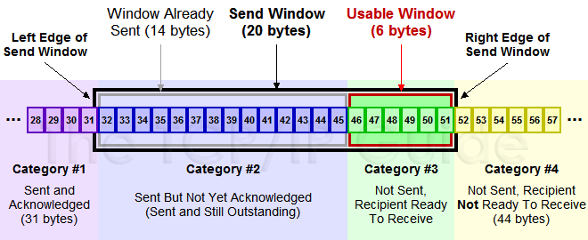
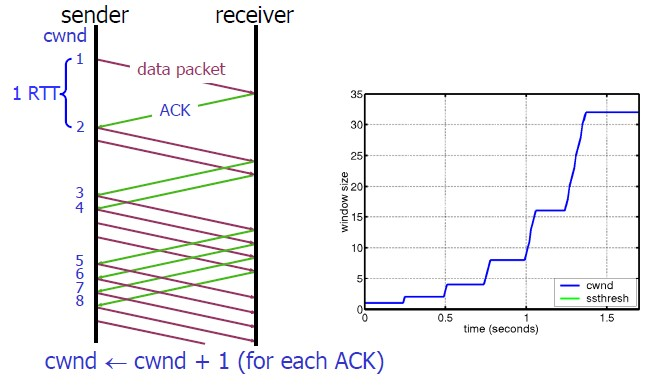
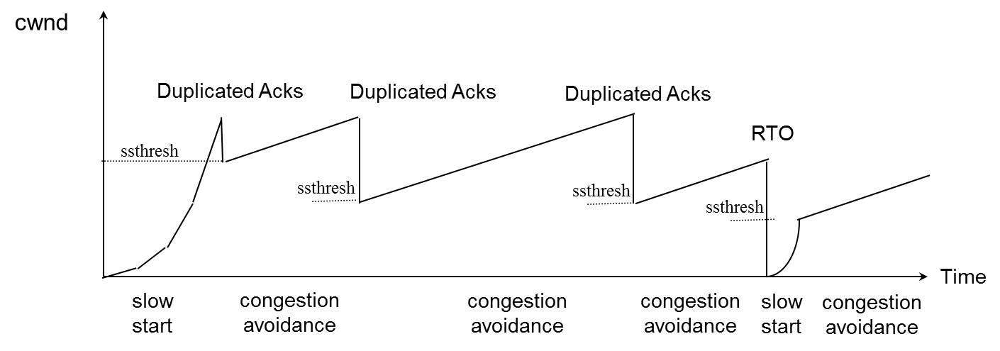

上文[浅谈TCP（1）：状态机与重传机制](/2018/03/07/浅谈TCP（1）：状态机与重传机制/)介绍了TCP的状态机与重传机制。本文介绍`流量控制`（Flow Control，简称流控）与`拥塞控制`（Congestion Control）。TCP依此保障网络的`QOS`（Quality of Service）。

>本文大部分内容基于[TCP 的那些事儿（下）](https://coolshell.cn/articles/11609.html)修改而来，部分观点与原文不同，重要地方增加了解释。

<!--more-->

# TCP的流量控制

## RTT算法

根据前文对TCP超时重传机制的介绍，我们知道Timeout的设置对于重传非常重要：

* 设长了，重发就慢，丢了老半天才重发，没有效率，性能差。
* 设短了，会导致可能并没有丢就重发。于是重发的就快，会增加网络拥塞，导致更多的超时，更多的超时导致更多的重发。

而且，这个超时时间在不同的网络环境下不同，必须动态设置。为此，TCP引入了`RTT`（Round Trip Time，环回时间）：一个数据包从发出去到回来的时间。这样，发送端就大约知道正常传输需要多少时间，据此计算`RTO`（Retransmission TimeOut，超时重传时间）。 听起来似乎很简单：在发送方发包时记下t0，收到接收方的Ack时记一个t1，于是RTT = t1 – t0。然而，这只是一个采样，不能代表网络环境的普遍情况。

### 经典算法

RFC793 中定义了一个`经典算法`：

1. 首先，采样RTT，记下最近几次的RTT值。
2. 然后，使用`加权移动平均算法`（Weighted Moving Average Method）做平滑，计算`SRTT`（Smoothed RTT）：
    
    ```
    SRTT = ( α * SRTT ) + ((1- α) * RTT) (通常取0.8≤α≤0.9，α越大收敛速度越快)
    ```
    
3. 最后，计算RTO：
RTO = min [ UBOUND,  max [ LBOUND,   (β * SRTT) ]  ] (通常取1.3≤β≤2.0)

### Karn / Partridge 算法

经典算法描述了RTO计算的基本思路，但还有一个重要问题：RTT的采样取“**第一次**发Seq+收Ack的时间”，还是“**重传**Seq+收Ack的时间”？

如图：


* 情况（a）中，RTT的采样取“第一次发Seq+收Ack的时间”。假设第一次发的Seq彻底丢包了，则采样到的时间**多算**了“从第一次发到重传的间隔”。
* 情况（b）中，RTT的采样取“重传Seq+收Ack的时间”。假设是Ack传输的慢，导致恰好刚重传就收到了接收方之前发出的Ack，则采样到的时间**少算**了“从第一次发到重传的间隔”。

问题的本质是：**发送方无法区分收到的Ack对应第一次发的Seq还是重传的Seq**（进入网络就都一样了）。针对该问题，`Karn / Partridge`算法选择回避重传的问题：_忽略重传的样本，RTT的采样只取未产生重传的样本_。

简单的忽略重传样本也有问题：假设当前的RTO很小，突然发生网络抖动，延时剧增导致要重传所有的包；由于忽略重传样本，RTO不会被更新，于是继续重传使网络更加拥堵；拥堵导致更多的重传，恶性循环直至网络瘫痪。Karn / Partridge算法用了一个取巧的办法：_只要一发生重传，就将现有的RTO值翻倍（指数回退策略），待网络恢复后再仿照经典算法逐渐平滑以降低RTO_。

该算法已经做到可用，然而网络抖动对性能的影响比较大。

### Jacobson / Karels 算法

前面两种算法均使用加权移动平均算法做平滑，这种方法的最大问题是：很难发现RTT值上的较大波动，因为被平滑掉了（1 - a比较小，即最新RTT的权重小）。针对该问题，`Jacobson / Karels`算法引入了最新采样的RTT值和平滑过的SRTT值的差距做因子，即`DevRTT`（Deviation RTT，RTT的偏离度），同时考虑SRTT带来的惯性和DevRTT带来的波动：

```
SRTT = SRTT + α(RTT – SRTT)  —— 计算SRTT
DevRTT = (1-β)*DevRTT + β*(|RTT-SRTT|) —— 计算SRTT和最新RTT的差距（加权移动平均）
RTO= µ * SRTT + ∂ *DevRTT —— 同时考虑SRTT（惯性）与DevRTT（波动）
```

Linux 2.6采用该算法计算RTO，默认取α = 0.125, β = 0.25, μ = 1, ∂ = 4（玄学调参，你懂的）。

## TCP滑动窗口

TCP使用`滑动窗口`（Sliding Window）做流量控制与`乱序重排`。乱序重排在TCP的重传机制中已经介绍，下面介绍流量控制。

TCP头里有一个字段叫Window（或Advertised Window），_用于接收方通知发送方自己还有多少缓冲区可以接收数据_。**发送方根据接收方的处理能力来发送数据，不会导致接收方处理不过来，是谓流量控制**。暂且把Advertised Window当做滑动窗口，更容易理解滑动窗口如何完成流量控制，后面介绍拥塞控制时再说明二者的区别。

观察TCP协议的发送缓冲区和接收缓冲区：


假设位置序号从左向右增长（常见的读、写缓冲区设计），解释一下：

* 发送方：LastByteAcked指向收到的连续最大Ack的位置；LastByteSent指向已发送的最后一个字节的位置；LastByteWritten指向上层应用已写完的最后一个字节的位置。
* 接收方：LastByteRead指向上层应用已读完的最后一个字节的位置；NextByteExpected指向收到的连续最大Seq的位置；LastByteRcvd指向已收到的最后一个字节的位置。可以看到**NextByteExpected与LastByteRcvd中间有些Seq还没有到达**，对应空白区。

据此在接收方计算`AdvertisedWindow`，在发送方计算`EffectiveWindow`：

* 接收方在Ack中记录自己的`AdvertisedWindow = MaxRcvBuffer – (LastByteRcvd - LastByteRead)`，随Ack回复到发送方。
* 发送方根据Ack中的AdvertisedWindow值，需保证`LastByteSent - LastByteAcked ≤ AdvertisedWindow`，则窗口内剩余可发送的数据大小`EffectiveWindow = AdvertisedWindow - (LastByteSent - LastByteAcked)`，以保证接收方可以处理。

### AdvertisedWindow与EffectiveWindow

AdvertisedWindow衡量接收方还能接收的数据量，发送方要根据AdvertisedWindow决定接下来发送的数据量上限，即EffectiveWindow（可能为0）。

#### AdvertisedWindow的计算

_由于乱序问题的存在，LastByteRcvd可能指向Seq(LastByteSent)，而Seq(LastByteAcked + 1)至Seq(LastByteSent - 1)都还在路上_，即将到达接收方，最好的情况是不丢包（丢包后会重传），_则LastByteRcvd之后、接收缓冲区边界之前的空间就是发送方下一次发送数据的长度上限_（重传不属于下一次发送），因此，`AdvertisedWindow = MaxRcvBuffer – (LastByteRcvd - LastByteRead)`。

#### EffectiveWindow的计算

_LastByteRcvd还可能指向Seq(LastByteAcked)（一个新包都没有收到）_，显然AdvertisedWindow的公式不变，_而Seq(LastByteAcked + 1)至Seq(LastByteSent)都还在路上_，未来将到达接收方，进入接收缓冲区，则“还在路上的Seq(LastByteAcked + 1)至Seq(LastByteSent)”不应超过接收缓冲区的剩余空间AdvertisedWindow（目前等于MaxRcvBuffer），这要求的是上一次发送满足LastByteSent - LastByteAcked ≤ AdvertisedWindow，_那么LastByteSent之后、接收缓冲区剩余空间边界之前的空间就是发送方窗口内剩余可发送数据的长度上限_，因此，`EffectiveWindow = AdvertisedWindow - (LastByteSent - LastByteAcked)`。

>当然，EffectiveWindow最小取0。

### 示例1

以下是一个发送缓冲区的滑动窗口：



上图分为4个部分：

* `#1`是已发送已确认的数据，即LastByteAcked之前的区域。
* `#2`是已发送未确认的数据，即LastByteAcked与LastByteSent之间的区域，大小不超过AdvertisedWindow。
* `#3`是窗口内未发送的数据，即LastByteSent与窗口右界之间的区域，大小等于EffectiveWindow（可能为0）。
* `#4`是窗口外未发送的数据，即窗口右界与LastByteWritten之间的区域。

其中，`#2 + #3`组成了滑动窗口，总大小不超过AdvertisedWindow，二者比例受到接收方的处理速度与网络情况的影响（如果丢包严重或处理速度慢于发送速度，则`#2:#3`会越来越大）。

### 示例2

以下是一个AdvertisedWindow的调整过程，EffectiveWindow随之变化：


### Zero Window

>理解有问题，不要求掌握。

~~上图，我们可以看到一个处理缓慢的Server（接收端）是怎么把Client（发送端）的发送窗口size给降成0的。对于接收方来说，此时接收缓冲区确实已经满了，因此令发送方的发送窗口size降为0以暂时禁止发送是合理的。那么，等接收方的接收缓冲区再空出来，怎么通知发送方新的window size呢？~~

~~针对这个问题，为TCP设计了ZWP技术（Zero Window Probe，零窗通告）：发送方在窗口变成0后，会发ZWP的包给接收方，让接收方来Ack他的Window尺寸；ZWP的重传也遵循指数回退策略，默认重试3次；如果3次后window size还是0，则认为接收方出现异常，发RST重置连接（<font color="red">**部分文章写的是重试到window size正常？？？**</font>）。~~

~~注意：只要有等待的地方都可能出现DDoS攻击，Zero Window也不例外。一些攻击者会在和服务端建好连接发完GET请求后，就把Window设置为0，于是服务端就只能等待进行ZWP；然后攻击者再大量并发发送ZWP，把服务器端的资源耗尽。（<font color="red">**客户端等待怎么耗服务端？？？**</font>）~~

# TCP的拥塞控制

>通信中的拥塞指：
>
>到达通信子网中某一部分的分组数量过多，使得该部分网络来不及处理，以致引起这部分乃至整个网络性能下降的现象，严重时甚至会导致网络通信业务陷入停顿即出现死锁。

为什么要进行拥塞控制？假设网络已经出现拥塞，如果不处理拥塞，那么延时增加，出现更多丢包，触发发送方重传数据，加剧拥塞情况，继续恶性循环直至网络瘫痪。可知，拥塞控制与流量控制的适应场景和目的均不同。

**拥塞发生前，可避免流量过快增长拖垮网络；拥塞发生时，唯一的选择就是降低流量**。主要使用4种算法完成拥塞控制：

1. 慢启动
2. 拥塞避免
3. 拥塞发生
4. 快速恢复

算法1、2适用于拥塞发生前，算法3适用于拥塞发生时，算法4适用于拥塞解决后（相当于拥塞发生前）。

## rwnd与cwnd

在正式介绍上述算法之前，先补充下`rwnd`（Receiver Window，接收者窗口）与`cwnd`（Congestion Window，拥塞窗口）的概念：

* rwnd是用于流量控制的窗口大小，即上述流量控制中的AdvertisedWindow，主要取决于接收方的处理速度，由接收方通知发送方被动调整（详细逻辑见上）。
* cwnd是用于拥塞处理的窗口大小，取决于网络状况，由发送方探查网络主动调整。

介绍流量控制时，我们没有考虑cwnd，认为发送方的滑动窗口最大即为rwnd。实际上，_需要同时考虑流量控制与拥塞处理，则发送方窗口的大小不超过`min{rwnd, cwnd}`_。下述4种拥塞控制算法只涉及对cwnd的调整，同介绍流量控制时一样，暂且不考虑rwnd，假定滑动窗口最大为cwnd；但读者应明确rwnd、cwnd与发送方窗口大小的关系。

## 4种拥塞控制算法

### 慢启动算法

`慢启动算法`（Slow Start）作用在拥塞产生之前：_对于刚刚加入网络的连接，要一点一点的提速，不要妄图一步到位_。如下：

1. 连接刚建好，初始化cwnd = 1（当然，通常不会初始化为1，太小），表明可以传一个MSS大小的数据。
2. 每收到一个ACK，cwnd++，线性增长。
3. 每经过一个RTT，cwnd = cwnd * 2，指数增长（主要增长来源）。
4. 还有一个ssthresh（slow start threshold），当cwnd >= ssthresh时，就会进入拥塞避免算法（见后）。

因此，如果网速很快的话，Ack返回快，RTT短，那么，这个慢启动就一点也不慢。下图说明了这个过程：



### 拥塞避免算法

前面说过，当cwnd >= ssthresh（通常ssthresh = 65535）时，就会进入`拥塞避免算法`（Congestion Avoidance）：_缓慢增长，小心翼翼的找到最优值_。如下：

1. 每收到一个Ack，cwnd = cwnd + 1/cwnd，显然，cwnd > 1时无增长。
2. 每经过一个RTT，cwnd++，线性增长（主要增长来源）。

慢启动算法主要呈指数增长，粗犷型，速度快（“慢”是相对于一步到位而言的）；而拥塞避免算法主要呈线性增长，精细型，速度慢，但更容易在不导致拥塞的情况下，找到网络环境的cwnd最优值。

### 拥塞发生时的算法

慢启动与拥塞避免算法作用在拥塞发生前，采取不同的策略增大cwnd；如果已经发生拥塞，则需要采取策略减小cwnd。那么，TCP如何判断当前网络拥塞了呢？很简单，**如果发送方发现有Seq发送失败（表现为“丢包”），就认为网络拥塞了**。

丢包后，有两种重传方式，对应不同的网络情况，也就对应着两种拥塞发生时的控制算法：

1.  超时重传。TCP认为这种情况太糟糕，调整力度比较大：
    1. ssthresh =  cwnd /2
    2. cwnd = 1，重新进入慢启动过程（网络糟糕，要慢慢调整）
2. 快速重传。TCP认为这种情况通常比RTO超时好一些，主流实现TCP Reno的调整力度更柔和（TCP Tahoe的实现和RTO超时一样暴躁）：
    1. ssthresh =  cwnd /2
    2. cwnd = cwnd /2，进入快速恢复算法（网络没那么糟，可以快速调整，见下）

可以看到，不管是哪种重传方式，ssthresh都会变成cwnd的一半，仍然是_指数回退，待拥塞消失后再逐渐增长回到新的最优值_，总体上在最优值（动态）附近震荡。

回退后，根据不同的网络情况，可以选择不同的恢复算法。慢启动已经介绍过了，下面介绍快速恢复算法。

### 快速恢复算法

如果触发了快速重传，即发送方收到至少3次相同的Ack，那么TCP认为网络情况不那么糟，也就没必要提心吊胆的，可以适当大胆的恢复。为此设计`快速恢复算法`（Fast Recovery），下面介绍TCP Reno中的实现。

回顾一下，进入快速恢复之前，cwnd和sshthresh已被更新：

1. ssthresh = cwnd /2
2. cwnd = cwnd /2

然后，进入快速恢复算法：

1. cwnd = ssthresh  + 3 * MSS （尝试一步到位）
2. 重传重复Ack对应的Seq
3. 如果再收到该重复Ack，则cwnd++，线性增长（缓慢调整）
4. 如果收到了新Ack，则cwnd = ssthresh ，然后就进入了拥塞避免的算法了（<font color="red">**为什么收到新Ack要降低sshthresh？？？**</font>）

>可暂时忽略的内容：
>
>这种实现也有问题：依赖于3个重复Ack。回忆上文讨论的“重传一个还是重传所有的问题”，3个重复Ack并不代表只丢了一个数据包，很有可能是丢了好多包。显然快速恢复算法选择“重传一个”，而剩下的那些包只能等到RTO超时。于是，超时一个窗口就减半一下，多个超时会超成TCP的传输速度指数级下降；同时，超时重传不会触发快速恢复算法，慢启动很容易加剧超时的情况，进入恶性循环。

## 示例

下面看一个简单的图示，感受拥塞控制过程中的cwnd变化：



---

>参考：
>
>* [TCP 的那些事儿（下）](https://coolshell.cn/articles/11609.html)
>* [网络基础3-传输层](http://note.youdao.com/noteshare?id=6d985d9492109ec8c1f8b896a06381a3)
>
