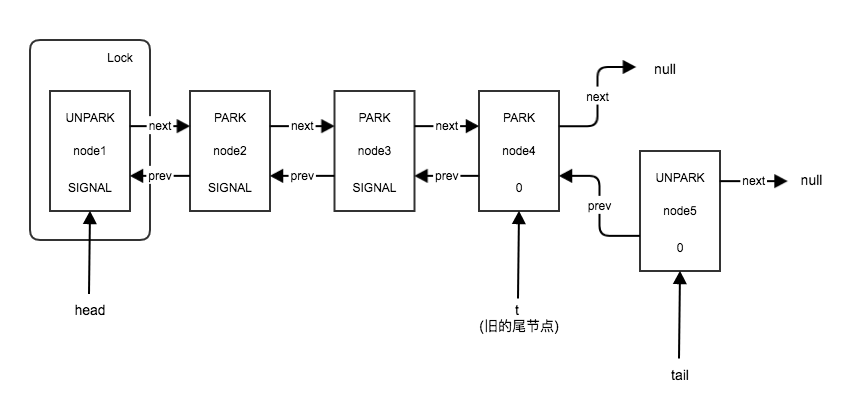
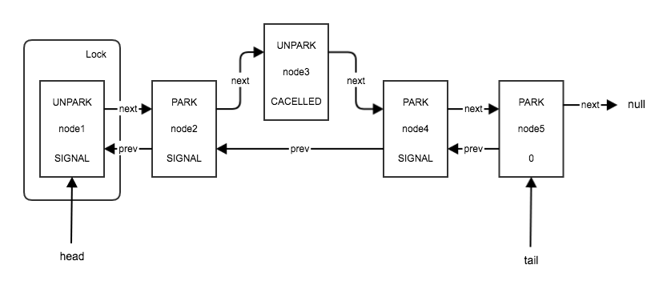
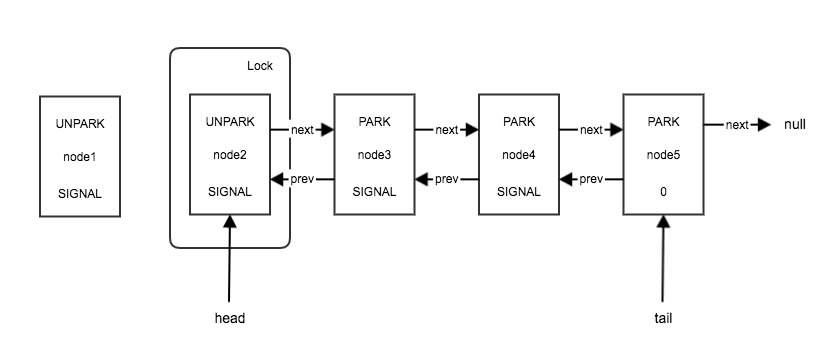

显示锁ReentrantLock的内部同步依赖于AQS（AbstractQueuedSynchronizer），因此，分析ReentrantLock必然涉及AQS。

本文假设读者已熟练掌握AQS的基本原理（参考[AQS的基本原理](/2017/12/04/AQS的基本原理/)），通过分析ReentrantLock#lock()与ReentrantLock#unlock()的实现原理，用实例帮助读者理解AQS的等待队列模型。

<!--more-->

>JDK版本：oracle java 1.8.0_102

# 接口声明

```java
public interface Lock {
    void lock();

    void lockInterruptibly() throws InterruptedException;

    boolean tryLock();

    boolean tryLock(long time, TimeUnit unit) throws InterruptedException;

    void unlock();

    Condition newCondition();
}
```

ReentrantLock对标内置锁，实现了Lock接口。忽略Condition相关，主要提供lock、unlock两种语义，和两种语义的衍生品。

# 实现原理

## 继承AQS

>本文中的“继承”指“扩展extend”。

### AQS复习

AQS并提供了多个未实现的protected方法，留给作者覆写以开发不同的同步器:

```java
public abstract class AbstractQueuedSynchronizer
    extends AbstractOwnableSynchronizer
    implements java.io.Serializable {
    ...
    protected boolean tryAcquire(int arg) {
        throw new UnsupportedOperationException();
    }
    protected boolean tryRelease(int arg) {
        throw new UnsupportedOperationException();
    }
    protected int tryAcquireShared(int arg) {
        throw new UnsupportedOperationException();
    }
    protected boolean tryReleaseShared(int arg) {
        throw new UnsupportedOperationException();
    }
    protected boolean tryReleaseShared(int arg) {
        throw new UnsupportedOperationException();
    }
    ...
}
```

而其他非私有方法则使用final修饰，禁止子类覆写。

### 继承

ReentrantLock支持公平、非公平两种策略，并通过继承AQS实现了对应两种策略的同步器NonfairSync与FairSync。ReentrantLock默认使用非公平策略，即NonfairSync：

```java
    public ReentrantLock() {
        sync = new NonfairSync();
    }
    ...
    static final class NonfairSync extends Sync {
        private static final long serialVersionUID = 7316153563782823691L;

        final void lock() {
            ...
        }

        protected final boolean tryAcquire(int acquires) {
            return nonfairTryAcquire(acquires);
        }
    }
    abstract static class Sync extends AbstractQueuedSynchronizer {
        ...
        abstract void lock();

        final boolean nonfairTryAcquire(int acquires) {
            ...
        }

        protected final boolean tryRelease(int releases) {
            ...
        }

        final ConditionObject newCondition() {
            return new ConditionObject();
        }
        ...
    }
    ...
```

先不追究细节。下面以默认的非公平策略为例，讲解lock和unlock的实现。 

## lock

```java
    public void lock() {
        sync.lock();
    }
```

非公平策略下，sync指向一个NonfairSync实例。

```java
    static final class NonfairSync extends Sync {
        ...
        final void lock() {
            if (compareAndSetState(0, 1))
                setExclusiveOwnerThread(Thread.currentThread());
            else
                acquire(1);
        }
        ...
    }
```

**ReentrantLock用state表示“所有者线程已经重复获取该锁的次数”**。当state等于0时，表示当前没有线程持有该锁，因此，将state CAS设置为1，并记录排他的所有者线程ownerThread（*ownerThread只会在0->1及1->0两次状态转换中修改*）；否则，state必然大于0，则尝试再获取一次锁。ownerThread将在state大于0时，用于判断重入性。

>* 排他性：如果线程T1已经持有锁L，则不允许除T1外的任何线程T持有该锁L
>* 重入性：如果线程T1已经持有锁L，则允许线程T1多次获取锁L，更确切的说，获取一次后，可多次进入锁。
>
>二者结合，描述了ReentrantLock的一个性质：允许ownerThread重入，不允许其他线程进入或重入。

### acquire

```java
public abstract class AbstractQueuedSynchronizer
    extends AbstractOwnableSynchronizer
    implements java.io.Serializable {
    ...
    public final void acquire(int arg) {
        if (!tryAcquire(arg) &&
            acquireQueued(addWaiter(Node.EXCLUSIVE), arg))
            selfInterrupt();
    }
    static void selfInterrupt() {
        Thread.currentThread().interrupt();
    }
    ...
}
```

改写：

```java
public abstract class AbstractQueuedSynchronizer
    extends AbstractOwnableSynchronizer
    implements java.io.Serializable {
    ...
    public final void acquire(int arg) {
        if (tryAcquire(arg)) {
            return;
        }
        Node newNode = addWaiter(Node.EXCLUSIVE);
        boolean interrupted = acquireQueued(newNode, arg);
        if (interrupted) {
            selfInterrupt();
        }
    }
    ...
}
```

首先，通过tryAcquire()尝试获取锁。按照AQS的约定，`tryAcquire()返回true表示获取成功，可直接返回；否则获取失败`。如果获取失败，则向等待队列中添加一个独占模式的节点，并通过acquireQueued()阻塞的等待该节点被调用（即当前线程被唤醒）。如果是因为被中断而唤醒的，则复现中断信号。

#### tryAcquire

NonfairSync覆写了AQS#tryAcquire()：

```java
    static final class NonfairSync extends Sync {
        ...
        protected final boolean tryAcquire(int acquires) {
            return nonfairTryAcquire(acquires);
        }
        ...
    }
    abstract static class Sync extends AbstractQueuedSynchronizer {
        ...
        final boolean nonfairTryAcquire(int acquires) {
            final Thread current = Thread.currentThread();
            int c = getState();
            if (c == 0) {
                if (compareAndSetState(0, acquires)) {
                    setExclusiveOwnerThread(current);
                    return true;
                }
            }
            else if (current == getExclusiveOwnerThread()) {
                int nextc = c + acquires;
                if (nextc < 0) // overflow
                    throw new Error("Maximum lock count exceeded");
                setState(nextc);
                return true;
            }
            return false;
        }
        ...
    }
```

12-17行重复了NonfairSync#lock()中state=0时的状态转换。18行进行排他性判断，如果当前线程等于ownerThread，则直接返回false。否则，19-22行进行重入，state加1（acquires=1），表示所有者线程重复获取该锁的次数增加1。

>实际上，NonfairSync#lock()不需要特殊处理state=0时的状态转换。可通过NonfairSync#tryAcquire()、Sync#nonfairTryAcquire()完成。

##### 为什么19-22行不需要同步

注意，如果18行判断当前线程等于ownerThread，则根据程序顺序规则，19-22行不需要同步。因为**同一线程中，第二次调用NonfairSync#tryAcquire()时（会进入19-22行），第一次调用锁写入的state、ownerThread一定是可见的**。

##### 为什么要用state表示重入次数

如果没有记录重入次数，则第一次释放锁时，会一次性把ownerThread多次重入的锁都释放掉，而此时“锁中的代码”还没有执行完成，造成混乱。

#### addWaiter

如果tryAcquire()获取失败，则要通过AQS#addWaiter()向等待队列中添加一个独占模式的节点，并返回该节点：

```java
public abstract class AbstractQueuedSynchronizer
    extends AbstractOwnableSynchronizer
    implements java.io.Serializable {
    ...
    private Node addWaiter(Node mode) {
        Node node = new Node(Thread.currentThread(), mode);
        // Try the fast path of enq; backup to full enq on failure
        Node pred = tail;
        if (pred != null) {
            node.prev = pred;
            if (compareAndSetTail(pred, node)) {
                pred.next = node;
                return node;
            }
        }
        enq(node);
        return node;
    }
    private Node enq(final Node node) {
        for (;;) {
            Node t = tail;
            if (t == null) { // Must initialize
                if (compareAndSetHead(new Node()))
                    tail = head;
            } else {
                node.prev = t;
                if (compareAndSetTail(t, node)) {
                    t.next = node;
                    return t;
                }
            }
        }
    }
    ...
}
```

AQS#enq()中重复了9-15行的逻辑，直接看enq()。

如果尾指针为null，则头指针也一定为null，表示等待队列未初始化，就CAS初始化队列（常见于无阻塞队列的设计中，如[源码|并发一枝花之BlockingQueue](/2017/10/18/源码|并发一枝花之BlockingQueue/)），然后继续循环。如果尾指针非null，则队列已初始化，就CAS尝试在尾节点后插入新的节点node。

>在插入过程中，会出现“node.prev指向旧的尾节点，但旧的尾节点.next为null未指向node（尽管，尾指针指向node）”的状态，即“**队列在prev方向一致，next方向不一致**”。记住该状态，分析ReentrantLock#unlock()时会用到。

最后，enq()返回旧的尾节点。但外层的AQS#addWaiter()仍然返回新节点node。

>队列刚完成初始化时，存在一个dummy node。插入节点时，tail后移指向新节点，head不变仍然指向dummy node。直到调用AQS#acquireQueued()时，head才会后移，消除了dummy node，后面分析。

#### acquireQueued

插入新节点node后，通过AQS#acquireQueued()阻塞的等待该节点被调用（即当前线程被唤醒）：

```java
public abstract class AbstractQueuedSynchronizer
    extends AbstractOwnableSynchronizer
    implements java.io.Serializable {
    ...
    final boolean acquireQueued(final Node node, int arg) {
        boolean failed = true;
        try {
            boolean interrupted = false;
            for (;;) {
                final Node p = node.predecessor();
                if (p == head && tryAcquire(arg)) {
                    setHead(node);
                    p.next = null; // help GC
                    failed = false;
                    return interrupted;
                }
                if (shouldParkAfterFailedAcquire(p, node) &&
                    parkAndCheckInterrupt())
                    interrupted = true;
            }
        } finally {
            if (failed)
                cancelAcquire(node);
        }
    }
    ...
}
```

该方法是lock过程的核心难点，需要结合AQS#addWaiter()理解AQS内部基于等待队列的同步模型。

AQS的核心是状态依赖，可概括为两条规则：

* 当状态还没有满足的时候，节点会进入等待队列。
* 特别的，获取成功的节点成为队列的头结点。

首先，AQS#addWaiter()会将新节点node加入队尾（维护规则“当状态还没有满足的时候，节点会进入等待队列”），然后，AQS#acquireQueued()检查node的前继节点是否是头节点。如果是，则尝试获取锁；如果不是，或获取所失败，都会尝试阻塞等待。

如果11行获取锁成功，则更新头节点（维护规则“获取成功的节点成为队列的头结点”），修改failed标志，并返回interrupted标志。interrupted初始化为false，可能在17-19行被修改。

>初始化队列后的第一次更新头结点，直接setHead消除了dummy node。消除之后，实际节点代替了dummy node的作用，但与dummy node不同的是，该节点是持有锁的。

如果11行判断前继节点不是头节点或获取锁失败，则进入17-19行。AQS.shouldParkAfterFailedAcquire()判断是否需要阻塞等待，如果需要，则通过AQS#parkAndCheckInterrupt()阻塞等待，直到被唤醒或被中断。

##### shouldParkAfterFailedAcquire

AQS.shouldParkAfterFailedAcquire()根据pred.waitStatus判断新节点node是否应该被阻塞：

```java
public abstract class AbstractQueuedSynchronizer
    extends AbstractOwnableSynchronizer
    implements java.io.Serializable {
    ...
    private static boolean shouldParkAfterFailedAcquire(Node pred, Node node) {
        int ws = pred.waitStatus;
        if (ws == Node.SIGNAL)
            return true;
        if (ws > 0) {
            do {
                node.prev = pred = pred.prev;
            } while (pred.waitStatus > 0);
            pred.next = node;
        } else {
            compareAndSetWaitStatus(pred, ws, Node.SIGNAL);
        }
        return false;
    }
    ...
}
```

AQS#addWaiter()构造新节点时，pred.waitStatus使用了默认值0。此时，进入14-16行，CAS设置pred.waitStatus为`SIGNAL==-1`。最后返回false。

回到AQS#acquireQueued()中后，由于AQS#parkAndCheckInterrupt()返回false，循环会继续进行。假设node的前继节点pred仍然不是头结点或锁获取失败，则会再次进入AQS#parkAndCheckInterrupt()。上一轮循环中，已经将pred.waitStatus设置为`SIGNAL==-1`，则这次会进入7-8行，直接返回true，表示应该阻塞。

什么时候会遇到`ws > 0`的case呢？当pred所维护的获取请求被取消时，pred.waitStatus会被设置为`CANCELLED==1`，从而进入9-14行。改写：

```java
if (ws > 0) {
    do {
        pred = pred.prev;
        node.prev = pred;
    } while (pred.waitStatus > 0);
    pred.next = node;
}
```

逻辑很简单，循环移除所有被取消的前继节点pred，直到找到未被取消的pred。移除所有被取消的前继节点后，直接返回false。

>注意，在执行6行之前，队列处于“node.prev指向最新的前继节点，但pred.next指向已经移除的后继节点”的状态，即“**队列在prev方向一致，next方向不一致**”。记住该状态，分析ReentrantLock#unlock()时会用到。

**此处不需要检查前继节点是否为null**。因为等待队列的头结点要么是dummy node，满足`dummy.waitStatus==0`；要么是刚替换的real node，满足`real.waitStatus==0`；要么是后继节点已经阻塞的节点，满足`real.waitStatus==SIGNAL==-1`。则最晚遍历到头结点时，一定会退出循环，不会出现pred为null的情况。

回到AQS#acquireQueued()后，重新检查前继节点是否为头节点，并作出相应处理。

经过多次循环执行AQS.shouldParkAfterFailedAcquire()后，等待队列趋于稳定。最终的稳定状态为：

* **除了头节点，剩余节点都会返回true，表示需要阻塞等待**。
* **除了尾节点，剩余节点都满足`waitStatus==SIGNAL`，表示释放后需要唤醒后继节点**。

##### parkAndCheckInterrupt

```java
public abstract class AbstractQueuedSynchronizer
    extends AbstractOwnableSynchronizer
    implements java.io.Serializable {
...
    private final boolean parkAndCheckInterrupt() {
        LockSupport.park(this);
        return Thread.interrupted();
    }
...
}
```

AQS#parkAndCheckInterrupt()借助LockSupport.park()实现阻塞等待。最后调用Thread.interrupted()检查是否被中断，并清除中断状态，并返回中断标志。

如果是被中断的，则需要在外层AQS#acquireQueued()中重新设置中断标志interrupted，并在下一次循环中返回。然后在更外层的AQS#acquire()中调用AQS.selfInterrupt()重放中断。

>为什么不能直接在AQS#parkAndCheckInterrupt()返回后中断？因为返回中转标志能提供更大的灵活性，外界可以自行决定是即时重放、稍后重放还是压根不重放。Condition在得知AQS#acquireQueued()是被中断的之后，便没有直接复现中断，而是根据`REINTERRUPT`配置决定是否重放。

##### cancelAcquire

最后，如果在执行AQS#acquire()的过程中抛出任何异常，则取消任务：

```java
public abstract class AbstractQueuedSynchronizer
    extends AbstractOwnableSynchronizer
    implements java.io.Serializable {
    ...
    private void cancelAcquire(Node node) {
        ...
        node.waitStatus = Node.CANCELLED;
        ...
    }
    ...
}
```

因此，如果指考虑ReentrantLock#lock()方法的话，那么被标记为CACELLED状态的节点一定在获取锁时抛出了异常，AQS.shouldParkAfterFailedAcquire()中清理了这部分CACELLED节点。

>超时版ReentrantLock#tryLock()中，还可以由于超时触发取消。

### lock小结

ReentrantLock#lock()收敛后，AQS内部的等待队列如图：


## unlock

ReentrantLock#unlcok()与ReentrantLock#lcok()是对偶的。

```java
    public void unlock() {
        sync.release(1);
    }
```

获取锁以单位1进行，释放锁时也以单位1进行。

### release

```java
public abstract class AbstractQueuedSynchronizer
    extends AbstractOwnableSynchronizer
    implements java.io.Serializable {
    ...
    public final boolean release(int arg) {
        if (tryRelease(arg)) {
            Node h = head;
            if (h != null && h.waitStatus != 0)
                unparkSuccessor(h);
            return true;
        }
        return false;
    }
    ...
}
```

首先，通过tryRelease()尝试释放锁。按照AQS的约定，tryRelease()返回true表示已完全释放，可唤醒所有阻塞线程；否则没有完全释放，不需要唤醒。如果已完全释放，则只需要唤醒头结点的后继节点，该节点的ownerThread必然与头结点不同（如果相同，则之前lock时能够重入，不需要排队）；否则没有完全释放，不需要唤醒任何节点。

>对于独占锁，“完全释放”表示ownerThread的所有重入操作均已结束。

##### 解释8行的判断

如果`h == null`，则队列还未初始化（回忆AQS#enq()）。如果`h.waitStatus == 0`，则要么刚刚初始化队列，只有一个dummy node，没有后继节点（回忆AQS#enq()）；要么后继节点还没被阻塞，不需要唤醒（回忆等待队列的稳定状态）。

#### tryRelease

对照tryAcquire()分析tryRelease()：

```java
    abstract static class Sync extends AbstractQueuedSynchronizer {
        ...
        protected final boolean tryRelease(int releases) {
            int c = getState() - releases;
            if (Thread.currentThread() != getExclusiveOwnerThread())
                throw new IllegalMonitorStateException();
            boolean free = false;
            if (c == 0) {
                free = true;
                setExclusiveOwnerThread(null);
            }
            setState(c);
            return free;
        }
        ...
    }
```

5-6行很重要。如果存在某线程持有锁，则可以检查unlock是否被ownerThread触发；如果不存在线程持有锁，则`ownerThread==null`，可以检查是否在未lock的情况下进行unlock，或者重复执行了unlock。

>因此，使用ReentrantLock时，try-finally要这么写：
>
>```java
>Lock lock = new ReentrantLock();
>lock.lock();
>try {
>  // do sth
>} finally {
>  lock.unlcok();
>}
>```
>
>确保在调用lock()成功之后，才能调用unlock()。

接下来，8行判断是否将要进行`1->0`的状态转换，如果是，则可以完全释放锁，将ownerThread置为null。然后设置state。

最后，返回是否可完全释放的标志free。

##### 可见性问题

为了抓住核心功能，前面一直忽略了一个很重要的问题——`可见性`。忽略可见性问题的话，阅读源码基本没有影响，但自己实现同步器时将带来噩梦。

以此处为例，*是应该先执行8-11行，还是先执行12行呢？或者是无所谓呢？*

为保障可见性，必须先执行8-11行，再执行12行。因为**exclusiveOwnerThread的可见性要借助于（piggyback）于volatile变量state**：

```java
    ...
    private transient Thread exclusiveOwnerThread;
    ...
    private volatile int state;
    ...
```

配套的，也必须先读state，再读exclusiveOwnerThread：

```java
    abstract static class Sync extends AbstractQueuedSynchronizer {
        ...
        final boolean nonfairTryAcquire(int acquires) {
            ...
            int c = getState(); // 先读state
            if (c == 0) {
                ...
            }
            else if (current == getExclusiveOwnerThread()) {    // 再读exclusiveOwnerThread
                ...
            }
            return false;
        }
        ...
    }
```

核心是三条Happens-Before规则：

* `程序顺序规则`：如果程序中操作A在操作B之前，那么在线程中操作A将在操作B之前执行。
* `传递性`：如果操作A在操作B之前执行，并且操作B在操作C之前执行，那么操作A必须在操作C之前执行。
* `volatile变量规则`：对volatile变量的写入操作必须在对该变量的读操作之前执行。

具体来说，“先写exclusiveOwnerThread再写state；先读state再读exclusiveOwnerThread”的方案，保证了“在读state之后，_发生在写state之前的写exclusiveOwnerThread操作_对_发生在读state之后的读exclusiveOwnerThread操作_一定是可见的”。

>**程序顺序规则、传递性两条基本规则，经常与监视器锁规则、volatile变量规则显示的搭配，一定要掌握**。
>
>相对的，线程启动规则、线程结束规则、中断规则、终结器规则则通常被隐式的使用。

#### unparkSuccessor

```java
public abstract class AbstractQueuedSynchronizer
    extends AbstractOwnableSynchronizer
    implements java.io.Serializable {
    ...
    private void unparkSuccessor(Node node) {
        int ws = node.waitStatus;
        if (ws < 0)
            compareAndSetWaitStatus(node, ws, 0);

        Node s = node.next;
        if (s == null || s.waitStatus > 0) {
            s = null;
            for (Node t = tail; t != null && t != node; t = t.prev)
                if (t.waitStatus <= 0)
                    s = t;
        }
        if (s != null)
            LockSupport.unpark(s.thread);
    }
    ...
}
```

对lock过程的分析中，我们得知，队列中所有节点的waitStatus要么为0，要么为`SIGNAL==-1`。当`node.waitStatus==SIGNAL`时，表示node的后继节点s已被阻塞或正在被阻塞。现在需要唤醒s，则7-8行将node.waitStatus置0。

>注意，node.waitStatus一定不为`CANCELLED==1`，因为如果lock()方法没有执行成功，就无法通过unlock()方法调用AQS#unparkSuccessor()。

接下来，10-18行_从尾节点向前遍历，找到node后最靠近node的未取消的节点_，如果存在该节点s(`s!=null`)，就唤醒s.thread以竞争锁。

##### 一致性问题

为什么要从尾节点向前遍历，而不能从node向后遍历？这是因为，AQS中的等待队列基于一个弱一致性双向链表实现，允许某些时刻下，**队列在prev方向一致，next方向不一致**。

>理想情况下，队列每时每刻都处于一致的状态（强一致性模型），从node向后遍历找第一个未取消节点是更高效的做法。然而，维护一致性通常需要牺牲部分性能，为了进一步的提升性能，脑洞大开的神牛们想出了各种高性能的弱一致性模型。尽管模型允许了更多弱一致状态，但所有弱一致状态都在控制之下，不会出现一致性问题。

回忆lock过程的分析，有两个地方出现了这个弱一致状态：

* AQS#enq()插入新节点（包括AQS#addWaiter()）的过程中，旧的尾节点next为null未指向新节点。对应条件`s == null`。如图：



* AQS.shouldParkAfterFailedAcquire()移除CACELLED节点的过程中，中间节点指向已被移除的CACELLED节点。对应条件`s.waitStatus > 0`。如图：



因此，从node开始，沿着next方向向后遍历是行不通的。_只能从tail开始，沿着prev方向向前遍历，直到找到未取消的节点（`s != null`），或遍历完node的所有后继子孙（`s == null`）_。

>当然，`s == null`也可能表示node恰好是尾节点，该状态是强一致的，但仍然可以复用该段代码。

### unlock小结

ReentrantLock#unlock()收敛后，AQS内部的等待队列如图：



# 总结

本文的目标是借助对ReentrantLock#lock()与ReentrantLock#unlock()的分析，理解AQS的等待队列模型。

实际上，ReentrantLock还有一些重要的特性和API，如ReentrantLock#lockInterruptibly()、ReentrantLock#newCondition()。后面分先后分析这两个API，加深对AQS的理解。
